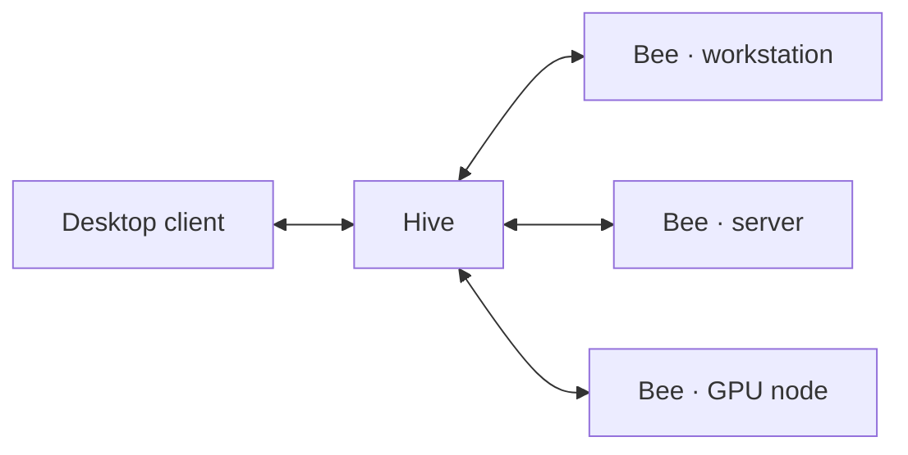
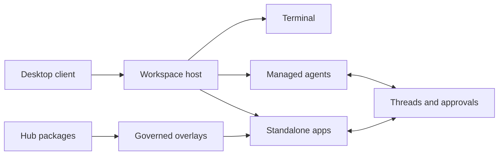

<p align="center">
  <a href="https://bee.wippy.ai/">
    
  </a>
</p>

<h1 align="center">Bee</h1>

<p align="center"><strong>A persistent terminal workspace for people, agents, and the tools they build together.</strong></p>

<p align="center">
  <a href="https://bee.wippy.ai/"><strong>Website</strong></a> ·
  <a href="docs/README.md">Documentation</a> ·
  <a href="https://github.com/wippyai/bee/releases">Releases</a> ·
  <a href="CONTRIBUTING.md">Contributing</a>
</p>

<p align="center">
  <a href="https://github.com/wippyai/bee/actions/workflows/native.yml"></a>
  <a href="https://github.com/wippyai/bee/releases"></a>
  <a href="LICENSE"></a>
  
</p>

Bee turns a terminal into a durable desktop. Shells, managed coding agents,
standalone applications, approvals, and threads share one workspace while
remaining separate processes with explicit authority. The executable embeds
the desktop and its default apps, so an existing installation can start
offline; Hub access is optional. Run one Bee on its own, or join multiple Bees
into a Hive to coordinate work across workstations, servers, and compute nodes.

<p align="center">
  <a href="https://bee.wippy.ai/">
    
  </a>
</p>

> [!IMPORTANT]
> Bee is an alpha. The planned first public release is **0.1.0a**, using the
> semantic version `v0.1.0-alpha.1`. Expect sharp edges and evolving contracts.

## Install a published alpha

Published alpha releases ship for Linux and macOS on amd64 and arm64.

```sh
curl -fsSLO https://raw.githubusercontent.com/wippyai/bee/v0.1.0-alpha.1/install.sh
sh install.sh --version 0.1.0-alpha.1
rm install.sh
```

The installer selects the platform archive, verifies its SHA-256 checksum, and
atomically places `bee` in `~/.local/bin`. You can instead download a checksummed
archive from [GitHub Releases](https://github.com/wippyai/bee/releases).

Open a project directory and start Bee:

```sh
cd my-project
bee
```

Press **F1** for Start, **Alt+Tab** to switch apps, **F11** to maximize, and
**Ctrl+Q** to detach. **F12** replaces the presenter while admitted applications
continue running.

## One workspace, many surfaces

| | Surface | What it provides |
|---:|---|---|
| ⌁ | **Desktop** | Retained layouts, themes, multiple displays, controller and read-only observer attachments |
| `>` | **Terminal** | Native interactive programs with the operating-system user's authority |
| ✦ | **Agents** | Claude, Codex, Agy, Grok, and Muse profiles with scoped MCP, hooks, durable threads, and recovery contracts |
| ◫ | **Apps** | Independent terminal applications with typed messages, owned state, services, migrations, and optional UI |
| ◆ | **Overlays** | Durable staged edits that move through review, approval, apply, and restart recovery |
| ⇄ | **Coordination** | Threads, Timeline, subscriptions, Inbox, Approvals, and scoped agent-to-agent launch |
| ⬡ | **Hub** | Read-only package inspection plus host-authorized planning, installation, migration, and receipts |

Launch a managed agent directly, or choose a saved profile from the Agent app:

```sh
bee claude
bee codex
bee agy
bee grok
bee muse
```

A profile selects a harness, isolation mode, options, persistent instructions,
and an MCP ceiling. Each turn supplies its own prompt and dynamic context. The
host resolves executables and credentials, then admits the exact launch under
its current policy.

## One Hive, many Bees

Multiple Bee nodes form a Hive. Each Bee keeps authority over its own
workspaces and databases while the Hive carries authenticated presence, typed
messages, approved projections, application coordination, and desktop
attachments between nodes. A client can connect to the Hive, see its Bees, and
work with an admitted remote workspace without turning local SQLite files into
one shared database.



Joining the transport does not grant application, workspace, or package
authority. Each destination still applies its own admission, approval, and
resource policy.

## Apps agents can build

An admitted agent can search Bee's offline platform corpus, inspect installed
components, author a declarative application in a durable overlay, request
review, and deliver the frozen result. Governance owns the persistent edit,
approval, activation, and recovery state; the agent never needs direct registry
publication authority.

Applications can expose functions, services, traits, database migrations,
threads, and terminal views. That makes workflows such as a test runner with a
live metrics UI possible without adding feature-specific machinery to Bee's
core.



Registry metadata describes capabilities; it does not authorize them. Packages
declare what they provide, the host selects what may run, and each owner keeps
its own state and migration ledger.

## Displays and recovery

A workspace can outlive the terminal presenting it. From another terminal:

```sh
bee desktops
bee observe
bee attach WORKSPACE DISPLAY
bee observe WORKSPACE DISPLAY
```

One display controls input and resize; observers are read-only. Detaching a
client leaves admitted applications running. Supported applications may restore
from their checkpoints after restart. A native Terminal process is deliberately
not treated as a portable checkpoint.

## Alpha boundaries

Local workspaces, retained desktops, attachments, configured multi-node Hives,
managed agents, Hub inspection and installation, governed overlays, approvals,
and durable threads are the implemented foundation. Public Hive enrollment and
discovery UX, destination-to-destination Hub transfer, managed Docker launch,
and automatic cross-node reconnect are still being completed.

See the [desktop guide](docs/guides/desktop.md), [agent MCP guide](docs/guides/agents/mcp.md),
[Hub guide](docs/guides/hub.md), and [overlay guide](docs/guides/overlays.md) for
the exact callable contracts and current limits.

## Build from source

Building requires Git, Go 1.27.0, a C compiler, and the platform development
tools documented in [native distribution](docs/operations/native.md).

```sh
make setup
make check
make standalone BEE_VERSION=0.1.0-alpha.1
./dist/bee
```

Development loads the root and selected components' `src/` trees. `make native-pack`
creates one checksummed WAPP for `bee/bee` and every physical dependency, plus a
source-free local deployment. The standalone executable embeds that same exact
pack set and the two small native boundaries Bee needs for host launch facts and
operating-system I/O events.

| Source | Owner |
|---|---|
| [`src/core`](src/core) | Workspace, application, desktop, client, and storage lifecycle |
| [`src/apps`](src/apps) | Bundled standalone application processes |
| [`modules/application/src`](modules/application/src) | Public application SDK and shared presentation values |
| [`modules/gateway/src`](modules/gateway/src) | Managed-agent gateway bindings, hooks, and MCP adapters |
| [`modules/gov`](modules/gov) | Overlay authoring, review, activation, and recovery |
| [`modules/hub`](modules/hub) | Package inspection, planning, apply, migration, and receipts |
| [`modules/threads/src`](modules/threads/src) | Durable records, subscriptions, and delivery |
| [`modules/docs/src`](modules/docs/src) | Offline documentation protocol and read-only corpus facade |
| [`modules/placement-native/src`](modules/placement-native/src) | Native launch attempts, receipts, materialization, supervision, and cleanup |
| [`modules/sync/src`](modules/sync/src) | Owner-local synchronized projections and immutable replica storage |
| [`modules/node/src`](modules/node/src) | Authorized native-node descriptions and appearance defaults |
| [`native`](native) | Generic application launch facts and OS I/O events |

Start with the [agent guide](docs/development/agent-guide.md) and
[development conventions](docs/development/conventions.md). The
[application contracts](docs/reference/applications.md),
[package boundaries](docs/development/package-boundaries.md), and
[ownership map](docs/development/ownership.md) describe the implemented model.

## License

Bee-owned code and artwork are [MIT](LICENSE). Wippy retains MPL-2.0;
dependencies retain their own licenses.

<p align="center">
  <a href="https://bee.wippy.ai/">bee.wippy.ai</a> ·
  <a href="https://github.com/wippyai/runtime">Wippy runtime</a> ·
  <a href="SECURITY.md">Security</a> ·
  <a href="https://github.com/wippyai/.github/blob/main/.github/CODE_OF_CONDUCT.md">Code of conduct</a>
</p>
