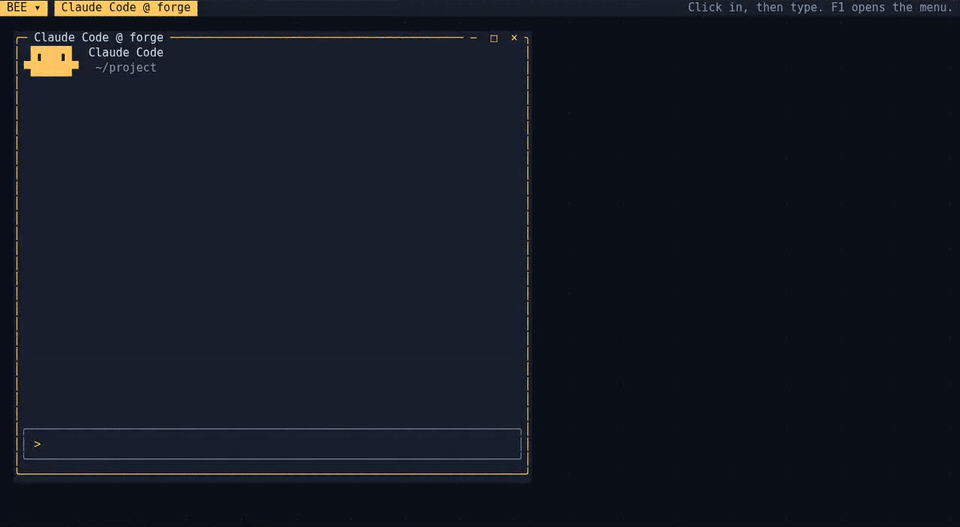

<p align="center">
  <a href="https://bee.wippy.ai/">
    
  </a>
</p>

<h1 align="center">Bee</h1>

<p align="center">
  <a href="https://bee.wippy.ai/">Website</a> ·
  <a href="https://github.com/wippyai/bee/releases">Releases</a>
</p>

<p align="center">
  <a href="https://github.com/wippyai/bee/actions/workflows/ci.yml"></a>
  <a href="https://github.com/wippyai/bee/releases"></a>
  <a href="LICENSE"></a>
</p>

<p align="center">
  
</p>

Bee is a persistent workspace your coding agents extend, built on the
[Wippy runtime](https://github.com/wippyai/runtime). Claude Code, Codex,
Antigravity, Grok, Muse and OpenCode run as sessions with their own live
terminal windows, next to a shell, your applications and **Needs you**, where
every decision waits for you. Agents drive other agents and build applications
that you and they both use, and bees on all your machines join one hive.

> [!IMPORTANT]
> Bee is alpha software. Contracts still change between releases.

## Features

- **Every coding agent in one workspace:** Claude Code, Codex, Antigravity, Grok, Muse and OpenCode run as sessions with live terminal windows; close a window and the agent keeps working.
- **Agents drive agents:** a scoped MCP server lets any agent open other agents' sessions, send them work, wait for results and talk on durable threads.
- **Apps built on demand:** ask in plain words and an agent builds a real Wippy application: a terminal UI for you, tools for agents, its own SQLite database with migrations, and Lua tests it runs inside Bee.
- **One approval, exact permissions:** an app asks for only what it needs, such as a database, agent tools, one HTTP origin or one command in a folder; **Needs you** shows what it can do and what data it changes, and nothing is decided twice.
- **Library:** apps and drivers your agents made, versions other bees share and Hub packages in one place, with updates, history, going back and removing while keeping data.
- **Bees on every machine:** `bee hive invite` and `bee hive join` connect machines across LAN, Tailscale and WSL; displays open any bee's desktops and apps install across the hive with each bee's own approval.
- **Agent-written drivers:** agents can add support for another CLI agent as a driver you approve.
- **Docs inside:** agents read Bee's documentation offline and search the live Wippy docs before they guess.
- **Local and in Docker:** agents run natively or in Docker as your own user, with private homes and granted folders only.
- **Durable:** sessions, threads, approvals and apps survive restarts; a session resumes where it stopped.
- **Single binary:** Linux and macOS, amd64 and arm64, verified install with one command.

## Install

Linux and macOS, amd64 and arm64:

```sh
curl -fsSL https://bee.wippy.ai/install.sh | sh
```

The installer takes the latest release, or the one `--version VERSION` names,
verifies its SHA-256 checksum and puts `bee` in `~/.local/bin`.

## Use

```sh
cd my-project
bee
```

Each folder runs its own Bee node with its own state. **Sessions** starts an
agent: **N** picks one, **Enter** opens it in a window, **H** runs it headless.
Closing a window leaves the agent running; reopen it from Sessions. **X**
closes a session.

Open an agent directly:

```sh
bee claude
bee codex
bee agy
bee grok
bee muse
bee opencode
```

Desktop keys: **Alt+Tab** switches windows, **Alt+F9** minimizes, **F11**
maximizes, **Ctrl+W** closes the focused app, **Ctrl+Q** leaves the desktop.

| Command | What it does |
| --- | --- |
| `bee` | Open this folder's desktop |
| `bee NAME` | Open an app by its command name, such as `bee claude` |
| `bee client` | Display a running node's desktops |
| `bee node` | Run this folder's node without a display |
| `bee hive init` | Join every Bee node on this machine into one hive |
| `bee hive invite` | Print a token that joins another machine to this hive; it is single use and valid ten minutes to join, and a joined machine stays in the hive. Keep it running until the other machine joins |
| `bee hive join TOKEN` | Join this machine to the hive the token names; bees already running restart themselves into it |
| `bee help` | Show the commands |
| `bee gov revert OWNER` | Restore an installed application's previous version from the command line |

### Agents working together

Every agent reaches Bee through a scoped MCP server. With it, an agent opens
other agents' sessions, sends them work, waits for or joins their results, and
closes them. Permission prompts and approvals from every session land in
**Needs you**.

### Applications made by agents

Ask an agent for a tool and it builds a real Wippy application: a terminal
window for you, tools other agents call, its own database with migrations, and
Lua tests it runs inside Bee. An application asks for exactly what it needs,
such as a database, agent tools, one HTTP origin or one exact command in a
folder. **Needs you** shows one install question that names who made it, what
it can do and what data it changes; approve it and the application opens from
Start → Apps. Agents can also write drivers for other CLI agents the same way.

**Library** lists everything you can install: applications and drivers your
agents made, versions other bees in your hive share, and Hub packages. It shows
updates and history, goes back to an earlier version, and removes an
application while keeping its data.

### Bees on every machine

```sh
bee hive invite          # on a machine whose bees should be shared
bee hive join TOKEN      # on the other machine
```

The token is single use and valid ten minutes to join; the joined machine
stays in the hive and every bee on it joins on its own, across LAN, Tailscale
and WSL. Displays open any bee's desktops, and an application one bee shares
installs on another with that bee's own approval.

## Documentation

Bee carries its documentation inside the binary, so agents read it offline
through the `docs` MCP tool and can also search the live
[Wippy docs](https://wippy.ai/llm/toc). The same pages are in
[`src/corpus`](src/corpus); start with the
[documentation map](src/corpus/docs/readme.md). For building applications,
read [application contracts](src/corpus/docs/application_contracts.md),
[delivery](src/corpus/docs/distributed_app_delivery.md) and the
[terminal toolkit](src/corpus/toolkit.md).

## Build

Requires Git, Go and a C compiler.

```sh
make tools
make lint
make test
make build
./dist/bee
```

Releases build from the runtime commit pinned in `wippy.build.json`;
`make runtime-pin RUNTIME_VERSION=<commit>` moves the pin and
`make native-pin` pins Bee's native module to the pushed commit that holds it.

## License

Bee code and artwork are [MIT](LICENSE). Wippy is MPL-2.0; dependencies keep
their own licenses.
