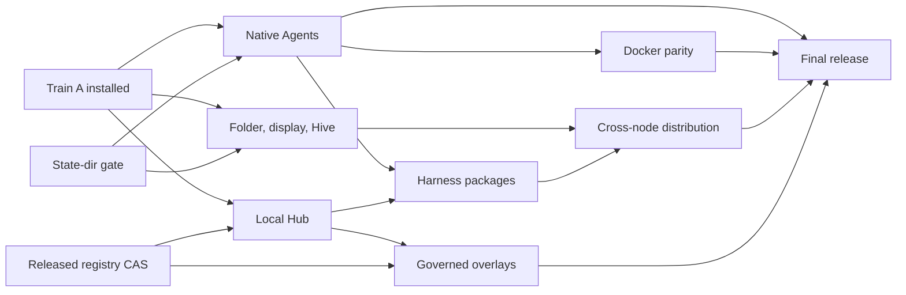

# Finishing Bee

This is the operational plan for the first complete Bee release. Bee is finished
when one installed executable is a dependable local coding desktop, can run
managed coding agents locally or in Docker, can join other Bees through the
native mesh, can install independently packaged components from Hub, and can
apply reviewed registry overlays through governance.

The implementation stays inside the boundaries already built:

- the workspace host owns applications and retained application state;
- a display owns presentation and layout, and an attachment owns live control or
  observation;
- threads own durable Agent communication and subscriptions;
- the native mesh and Hive supervisors carry cross-node operations;
- the Hub resolves immutable content but does not authorize it;
- governance decides protected changes and the registry owner applies them;
- native `exec.docker` is the only Docker execution path.

There will be no second mesh, Bee message-ingress API, alternate registry,
Docker control plane, or dependency on `../bee-legacy`. Production loads only
`src/`; tests and fixtures stay outside the pack.

## Current truth

The installed Train A executable has SHA-256 `4692e267` and source `414c03b`.
It is the rollback point. It passed offline boot, native Agent selection, scoped
Codex MCP/hooks, recovery, pack inspection and atomic installation.

The integration branch is `feat/docker-harness-delivery-20260913`. Its committed
implementation is `df31a70`; the finish-plan commit is `18e7e85`.

Completed on this branch:

- all four CLI aliases resolve the same managed definitions as the Agent picker;
- raw-argument and duplicate-alias bypasses refuse before admission;
- Claude and Codex inherit their normal global configuration additively;
- Agy additive configuration inheritance is complete;
- the direct native Docker PTY and lower placement foundations pass;
- the Hub already implements most of its local immutable
  install/update/remove, migration, receipt and recovery backend;
- workspace host/client, display, Hive, thread, gateway, governance and
  authoring foundations exist, but their final public journeys do not.

The uncommitted Grok B1.1 candidate is **not landable**. Its generalized setup
delivery and optional-login behavior pass 888 Lua tests and fixture acceptance,
but real Grok 1.0.30 owns and removes `.grok/managed_config.toml`. Bee cannot use
that file for a durable snapshot of the user's configuration. The next change
must remove the invalid destination and its documentation claims before B1.1 is
committed. Global Bee must not be built from this dirty worktree.

### Reusable runtime gates

Bee implementation continues while these reusable runtime proofs are completed
in separate PRs assigned to `skhaz`:

1. **Selected default state directory.** The executable supplies one default
   state root to every database/resource declaration; explicit `--state-dir`
   takes precedence. Existing explicit paths retain their meaning.
2. **Atomic registry compare-and-set.** Hub publication and overlay activation
   can bind a write to the reviewed registry revision. A concurrent writer causes
   a conflict before publication.
3. **Remote actor lifecycle.** Native mesh acceptance proves authenticated public
   enrollment/discovery, exact remote actor exit delivery, destination restart and
   same-name rejoin without a Bee remote-monitor subsystem.

The next global promotion requires gate 1. Connected Bee requires gate 3. Hub
admission and governed activation require gate 2. Candidate binaries may be used
for acceptance, but Bee does not merge these runtime PRs.

## Definition of finished

These six journeys must pass from one tagged executable:

1. **Open locally.** `bee` starts offline in the current folder without waiting
   for Hive, restores the correct project workspace, and gives each client an
   independent durable display.
2. **Run an Agent.** The picker and `bee claude|codex|agy|grok` run the user's
   ordinary installed harness with its global behavior intact, plus admitted Bee
   instructions, hooks and MCP. Each window has one durable thread and predictable
   close, restart and recovery behavior.
3. **Change isolation.** The same saved profile runs locally or through native
   `exec.docker`. Identity, thread, project, tools, terminal behavior and recovery
   stay the same; only isolation changes.
4. **Join a Hive.** Two real Bees connect through the native mesh, show clear
   Hive/node/workspace/display state, retain applications when a client leaves,
   and support controller transfer and observers.
5. **Install a component.** Modules plans, reviews, installs, updates, recovers
   and removes an immutable app or independently packaged harness. A destination
   Bee can install admitted content without receiving the source Bee's authority,
   credentials, processes or mounts.
6. **Edit safely.** A user or Agent stages an exact-revision overlay, reviews its
   source and capability changes, submits protected effects to the right inbox,
   and the registry owner applies or rejects it once. Apply and rollback have
   durable receipts.

## Critical path

The implementation lanes can run in parallel. Their release gates are
sequential and use immutable commits.

Folder/display/Hive work does not depend on finishing Agents. Local overlay work
does not depend on cross-node distribution. Package distribution and overlay
activation converge only at the final release.

## Work plan

### 0. Freeze state selection

Before the next global promotion, make the executable-selected folder derive one
default state root for all Bee databases and retained resources. Explicit
`--state-dir` wins. Prove old default state imports without deleting it, two
folders remain isolated, and profiles, conversations, threads, Hub receipts,
workspaces and displays survive restart and a binary upgrade.

Exit proof: the installed executable opens the intended folder offline and every
store resolves beneath the selected root or its explicit override.

### 1. Finish native Agents

This is the immediate lane and the shortest route to the next useful global
build.

1. Replace the invalid Grok managed-config design with the smallest
   provider-supported private composition:
   - first check the pinned runtime for a real TOML decoder/encoder;
   - if present, structurally compose the approved user `config.toml` snapshot
     with Bee's scoped `mcp_servers.bee` and hooks in private session state;
   - define an exact refusal or host-selected rule for an existing
     `mcp_servers.bee` collision;
   - if no structural codec exists, use only a documented stable Grok source;
     do not implement a broad hand-written TOML parser and do not write into the
     project or global `.grok` tree.
2. Prove real Grok clean start, authenticated start, cancel and restart. Hash the
   user's global and project trees before and after. The selected private config
   must remain present after Grok exits.
3. Complete clean-install defaults and saved profile create/edit/select. The
   public profile remains:

   `profile = harness + isolation + options + MCP scope`

   Stored additional instructions are profile data. Dynamic context and any
   function-built instruction text are resolved at admission and never become
   stored authority. Bee adds instructions to provider behavior; it does not
   replace the provider's built-in system prompt.
4. Bind every provider window to one durable thread, committed activity/title
   state and subscription cursor. Prove presenter, client and owner replacement.
5. Prove cold recovery where provider credentials permit it. Reconcile a
   surviving child before starting a replacement. Login, subscription and account
   refusals remain visible provider outcomes.

Exit proof: UI and CLI launch all four real harnesses; global settings remain
intact; scoped MCP and hooks reach the bound thread; cancel, close, restart and
resume work; pack inspection finds no credentials or fixtures.

### 2. Make folder, display and Hive behavior coherent

1. Consume the state-root decision from Plan 0 without deriving alternate paths
   inside Bee services.
2. Implement one public launch decision table:
   - `bee` in a new folder creates or reuses that project node/workspace and a
     current-terminal display;
   - another `bee` in the same project attaches or creates an independent display
     according to explicit controller rules;
   - explicit client/observe commands attach to a selected existing display and
     do not change the project selection.
3. Present the local desktop immediately. Hive join and rejoin run asynchronously.
   A remote node may remain connectable for 60 seconds, while local input, cancel
   and exit stay responsive.
4. Stop representing physical clients as durable Hive nodes. Displays have stable
   friendly identities, attachments have leases and generations, stale displays
   retire gradually, and retained applications/layout survive client loss.
5. Finish the compact shell switcher and F9 topology view. Show Hive service,
   executing node, workspace, display, controller/observer state and precise
   reachable/unavailable/unauthorized status without polling dead clients.
6. Implement safe `Send to display`: revoke or fence the previous controller
   before granting the next one; allow many observers; never let an uncertain
   result create two input controllers.
7. Prove two actual Bee runtimes over the existing native TLS mesh, including
   sleep/rejoin, remote viewport, resize/input, approval and retained apps.

Exit proof: offline folder boot is immediate, several clients/displays behave
predictably, stale records retire, and the two-node native-mesh journey passes.

### 3. Qualify local Hub and package components

1. Treat the current Hub backend as implemented foundation. Close its remaining
   combined regression and native lifecycle evidence instead of rebuilding its
   planner, migration or receipt model.
2. Require the released generic registry compare-and-set operation for every Hub
   publication. The current single-writer revision check is foundation evidence,
   not the final concurrent-writer guarantee.
3. Add the missing protected admission effect owner. Hub publication installs
   immutable definitions; it never grants their capabilities. An unadmitted app
   stays out of Tools and direct open refuses.
4. Bind approval to the exact artifact, definition digest, registry revision and
   host-selected capability set. Revalidate all four before the registry owner
   publishes the admission effect.
5. Preserve service-owned application configuration and state across update and
   restart. Registry metadata remains declarative; app data remains in its owning
   database.
6. Keep Claude, Codex, Agy and Grok as independent components. Prove one harness
   can be installed, updated and removed through Hub without editing Bee core;
   run the same packaging acceptance for all four before the final release.

Exit proof: clean and populated stores pass app and harness install/update/remove,
injected failure recovery, admission/revocation, restart and pack inspection.

### 4. Complete Docker as a profile choice

1. Route the existing carrier and managed-window lifecycle through the native
   `exec.docker` placement binding. Keep the same attempt owner, sweeper, thread,
   driver and gateway. Do not depend on the optional userspace Docker component.
2. Record creation intent before dispatch and label containers with exact
   owner/action/attempt identity. Implement start, stop, inspect, reconcile and
   cleanup, including surviving-container recovery.
3. Run the normal installed harness command. Mount the selected project and the
   minimum approved configuration/credential inputs. Keep Bee material and
   writable harness state in attempt/session storage. AppArmor is optional.
4. Expose the same randomized authenticated MCP/hook endpoint to the container;
   intersect profile scope, host policy and dynamic context at admission.
5. Prove PTY input/output/resize, close, cancellation, create/start failures,
   owner restart, container removal and absence of secrets from argv, records,
   logs and the production pack on Linux Engine and Docker Desktop/WSL.

Exit proof: changing only `isolation` from Local to Docker preserves the Agent's
identity, project, thread, tools, hooks, terminal and recovery behavior for all
four providers.

### 5. Distribute apps and harnesses through Hive

1. Transfer content-addressed immutable package data through supervisor-selected
   native-mesh operations. Reuse the Hub plan and receipt types; do not create a
   second installer or transport.
2. The destination independently resolves policy, reviews capability changes,
   admits and installs. Transfer package bytes and declared filesystem resources;
   never transfer credentials, grants, PIDs, live mounts or database ownership.
3. Add retry/restart recovery around content chunks and install receipts. A fat
   storage Bee is a role expressed by installed components and admitted
   interfaces, not a special topology.
4. Prove one app and one harness move to a second node, install, launch, restart
   and update while the source can disappear after transfer.

Exit proof: another Bee gains usable components from immutable admitted content
with no core edit and no authority leakage.

### 6. Finish governed overlays and self-edit

Use one path for user edits, Agent edits and installed overlay content:

`stage -> inspect -> submit -> decide -> apply -> receipt -> rollback`

1. Store the staged candidate durably with base registry revision, entry digests,
   source, declared capability changes and target scope. Staging grants nothing.
2. Show a review that distinguishes code/data changes, capability changes and
   protected core targets. Bind an inbox item to the exact candidate digest and
   effect.
3. The governance owner decides. The registry owner alone performs compare-and-set
   activation against the reviewed revision. A stale review conflicts and cannot
   silently replan.
4. Record applied revision, changed definitions and inverse data required for
   rollback. Rollback is another authorized compare-and-set operation.
5. Expose stage, inspect, status and submission through narrow Agent MCP tools.
   Agents never receive direct registry publication authority.
6. Replicate approved declarative overlays through the same package/content path.
   Service-owned databases and thread data keep their existing owners.

Exit proof: an Agent prepares an ordinary edit, the user reviews it, the owner
applies it once, protected changes require the configured approver, stale edits
refuse, and rollback restores the measured prior definitions.

## Global promotion checkpoints

Global Bee is updated only from a clean immutable integration commit. Docker does
not hold back a qualified native Agent build; later work continues in isolated
branches.

| Checkpoint | User-visible result | Required work |
|---|---|---|
| Native Agents | Correct offline folder state plus four working managed harnesses, profiles, threads and recovery | Plans 0 and 1 |
| Connected Bee | Correct folders/displays, two-node Hive and admitted local Hub components | Plans 2 and 3 |
| Docker Agents | The same four profiles work through native Docker | Plans 1 and 4 |
| Editable Bee v1 | Cross-node component delivery and governed overlays | Plans 1–6 |

Each promotion runs:

1. strict lint and focused behavioral acceptance;
2. source and packed user journeys;
3. one full `make check` with the exact pinned runtime;
4. a fresh standalone build and offline/restart/recovery checks;
5. production-pack inspection for tests, fixtures, credentials and local state;
6. an atomic six-file install with a recorded rollback receipt.

The six installed files are `bee`, `bee.LICENSES.txt`, `bee.go.mod`,
`bee.go.sum`, `bee.provenance.json` and `bee.runtime-patches.tar.gz`.
Every promotion preserves all databases, profiles, conversations, workspaces and
displays. Running owners may retain loaded code; acceptance of a new build uses a
fresh owner.

## Ownership and runtime boundary

Four implementation lanes may run concurrently: Agents, Docker, topology and
Hub. Distribution begins after topology and independently packaged Hub components
pass. Governed overlay work can begin after local Hub admission is stable and the
registry compare-and-set primitive is released.

Every unit has one editing owner, one bounded diff and one named executable exit
proof. Read-only audits can run in parallel. The integration owner accepts only
immutable commits with focused evidence, resolves conflicts, runs the release
gate once and performs global installation. Work that does not close a user
journey or an exit proof is deferred.

Any runtime semantic change is a separate runtime PR assigned to `skhaz`. Bee may
test against a pinned candidate, but it does not merge runtime PRs or carry a
private replacement API. Runtime changes are limited to reusable primitives;
Bee-specific policy stays in Bee.

## Final hardening

After all six journeys pass together:

- remove dead POC, fallback and superseded release paths;
- verify no test-only entries or fixtures are in production packs;
- measure cold/warm startup, idle CPU/goroutines/memory and bounded shutdown;
- run Linux, WSL, macOS, Docker Engine/Desktop and two-host Hive acceptance twice;
- audit migration from existing global databases and injected rollback failures;
- update implementation docs and `bee.wippy.ai` so claims and MIT notices match
  the tagged executable exactly.

No architecture-count test is a release gate. No database is deleted to make a
migration pass. Design proposals become implementation status only after their
public journey and executable acceptance exist.
