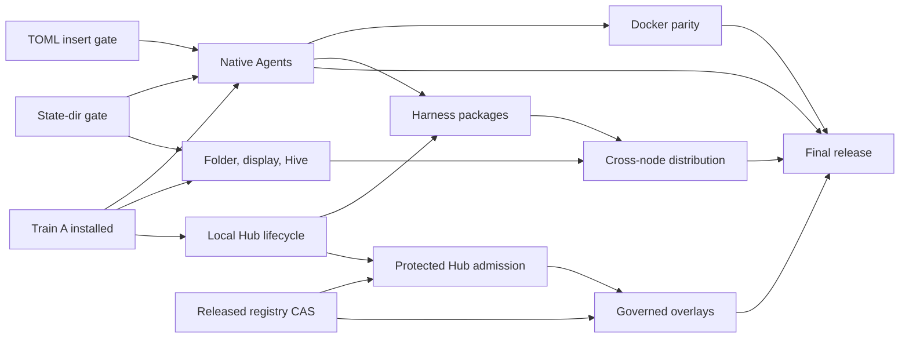

# Finishing Bee

This is the operational plan for the first complete Bee release. Bee is finished
when one installed executable is a dependable local coding desktop, can run
managed coding agents locally or in Docker, can join other Bees through the
native mesh, can install independently packaged components from Hub, and can
apply reviewed registry overlays through governance.

The implementation stays inside the boundaries already built:

- the workspace host owns applications and retained application state;
- a display owns presentation and layout, and an attachment owns live control or
  observation;
- threads own durable Agent communication and subscriptions;
- the native mesh and Hive supervisors carry cross-node operations;
- the Hub resolves immutable content but does not authorize it;
- governance decides protected changes and the registry owner applies them;
- native `exec.docker` is the only Docker execution path.

There will be no second mesh, Bee message-ingress API, alternate registry,
Docker control plane, or dependency on `../bee-legacy`. Production loads only
`src/`; tests and fixtures stay outside the pack.

## Current truth

The installed Train A executable has SHA-256 `4692e267` and source `414c03b`.
It is the rollback point. It passed offline boot, native Agent selection, scoped
Codex MCP/hooks, recovery, pack inspection and atomic installation.

The integration branch is `feat/docker-harness-delivery-20260913`. Grok B1.1 is
the immutable implementation base at `380d288`; later finish evidence builds on
it in bounded commits. This plan is the only finish queue for that branch. Older
handoff queues provide evidence and history but do not reorder this plan.

Completed on this branch:

- all four CLI aliases resolve the same managed definitions as the Agent picker;
- raw-argument and duplicate-alias bypasses refuse before admission;
- Claude and Codex inherit their normal global configuration additively;
- Agy and Grok additive configuration inheritance is complete;
- saved profiles are workspace-scoped, database-backed and revisioned; create,
  edit, select, tombstone, restart persistence and receipt replay pass;
- an exact-source standalone passes the four-provider selector, real Grok 1.0.30
  authenticated and clean/login/cancel/restart paths, graceful and abrupt
  fixture owner recovery, and real Agy, Codex and Grok cold conversation continuation;
- the direct native Docker PTY and lower placement foundations pass;
- the Hub already implements most of its local immutable
  install/update/remove, migration, receipt and recovery backend;
- workspace host/client, display, Hive, thread, gateway, governance and
  authoring foundations exist, but their final public journeys do not.

Grok B1.1 is committed. Its private retained configuration snapshots only an
approved user base, structurally inserts Bee's MCP section and refuses semantic
collisions or changed retained bases. Initializer digests bind before setup or a
ready marker becomes visible. The exact-source executable is
`/tmp/bee-grok-b11-final/bee` (SHA-256 `64679b3f...`) and uses runtime
`291f5c6b...`; the full Lua suite passes 893/893, strict lint passes with the one
existing `desktop_lifecycle` fixpoint warning, native window acceptance passes,
and global/project Grok trees remain unchanged. This is branch evidence, not a
global installation.

The immediate gap is the rest of the real-provider recovery matrix. Fixture
Claude now proves stable application, thread and retained HOME plus a fresh
attempt and gateway binding across graceful and abrupt owner restart. A durable
real-Agy acceptance proves exact tool-free recall after its source file is
deleted, with stable conversation/HOME/application/thread and fresh attempt and
gateway identities. The checked real-Codex acceptance now proves the same cold
recall plus its command read, scoped MCP/hook pairing and unchanged global
configuration. The checked real-Grok acceptance now proves matching provider/hook
conversation identity, scoped MCP, exact tool-free recall and stable global
configuration. Real Claude recovery remains. Codex and Grok now declare their
tested versions and must be rerun after the runtime cut; Claude metadata is
reconciled when its authenticated row qualifies.
Native Agents also remains blocked from global promotion until the selected-state-root
runtime gate is released and consumed.

### Reusable runtime gates

Bee implementation continues while these reusable runtime proofs are completed
in separate PRs assigned to `skhaz`:

1. **Selected default state directory.** The executable supplies one default
   state root to every database/resource declaration; explicit `--state-dir`
   takes precedence. Existing explicit paths retain their meaning.
2. **Atomic registry compare-and-set.** Hub publication and overlay activation
   can bind a write to the reviewed registry revision. A concurrent writer causes
   a conflict before publication.
3. **Remote actor lifecycle.** Native mesh acceptance proves authenticated public
   enrollment/discovery, exact remote actor exit delivery, destination restart and
   same-name rejoin without a Bee remote-monitor subsystem.
4. **Narrow structural TOML insertion.** Grok private configuration uses the
   reusable `toml.insert(document, path, source)` operation. Runtime PR #746 is
   assigned to `skhaz`; its candidate is pinned at `ce0c3e9d3b` with SHA-256
   `8d36335263418328f8a5c2ca117ce2fe612d890b3d5c74062eb69cb15408b240`.
   Bee does not expose general TOML parsing or carry a private copy of the codec.
5. **Authoritative OS-assigned HTTP address.** Managed MCP binds port zero and
   receives the actual listener address from the runtime owner; Bee never probes
   and races on a guessed free port.
6. **Exact Docker attempt mounts.** Native Docker execution accepts the measured
   per-attempt project, private HOME and admitted input mounts and supports
   reconciliation without granting Docker authority to Agent code.

The next global promotion requires gates 1, 4 and 5. Docker Agents additionally
requires gate 6. Connected Bee requires gate 3 and supervisor-host admission.
Hub admission and governed activation require gate 2. Candidate binaries may be
used for acceptance, but Bee does not merge these runtime PRs.

Before implementation claims depend on these gates, copy each accepted runtime
pin, digest, proof command and remaining limitation into
`docs/handoffs/STATUS_RUNTIME_GATE.md`. The finish plan orders work; that handoff
is the canonical runtime evidence.

## Definition of finished

These six journeys must pass from one tagged executable:

1. **Open locally.** `bee` starts offline in the current folder without waiting
   for Hive, restores the correct project workspace, and gives each client an
   independent durable display.
2. **Run an Agent.** The picker and `bee claude|codex|agy|grok` run the user's
   ordinary installed harness with its global behavior intact, plus admitted Bee
   instructions, hooks and MCP. Each window has one durable thread and predictable
   close, restart and recovery behavior.
3. **Change isolation.** The same saved profile runs locally or through native
   `exec.docker`. Identity, thread, project, tools, terminal behavior and recovery
   stay the same; only isolation changes.
4. **Join a Hive.** Two real Bees connect through the native mesh, show clear
   Hive/node/workspace/display state, retain applications when a client leaves,
   and support controller transfer and observers.
5. **Install a component.** Modules plans, reviews, installs, updates, recovers
   and removes an immutable app or independently packaged harness. A destination
   Bee can install admitted content without receiving the source Bee's authority,
   credentials, processes or mounts.
6. **Edit safely.** A user or Agent stages an exact-revision overlay, reviews its
   source and capability changes, submits protected effects to the right inbox,
   and the registry owner applies or rejects it once. Apply and rollback have
   durable receipts.

### Release scoreboard

This table is the progress view. A journey moves to **ready** only when its
installed-executable acceptance passes; source code or a fixture alone is
**partial**.

| Journey | State | Remaining release boundary |
|---|---|---|
| Open locally | partial | executable-selected state root for every store; offline folder and multi-display installed proof |
| Run an Agent | partial | durable four-provider cancel/restart/crash recovery matrix and selected-state-root promotion gate |
| Change isolation | foundation | compose the same saved profiles through native `exec.docker`; reconcile and recover containers |
| Join a Hive | partial | public enrollment/discovery, project-node selection, controller transfer, remote placement and two-real-runtime recovery |
| Install a component | partial | close local Hub lifecycle, protected admission and independently packaged app/harness proofs |
| Edit safely | foundation | complete the governed stage/review/apply/receipt/rollback journey over released registry CAS |

## Critical path

The implementation lanes can run in parallel. Their release gates are
sequential and use immutable commits.

Folder/display/Hive work does not depend on finishing Agents. Local overlay work
does not depend on cross-node distribution. Package distribution and overlay
activation converge only at the final release.

## Immediate execution queue

This queue turns the parallel lanes into reviewable promotions. A later item may
be implemented early when it does not share mutable files, but the global binary
advances only at the named promotion.

| Order | Lane | Work unit | Ends when |
|---|---|---|---|
| 1 | Agents before runtime cut | Commit the passing Grok recovery unit, finish real Claude cold recovery and reconcile provider version metadata; retain the passing Agy, Codex and Grok evidence without claiming promotion | All four providers have named recovery targets; Claude is authenticated and qualified; pre-cut evidence and exact provider versions are recorded |
| 2 | Runtime integration | Consume the released selected-state-root, structural TOML insertion and OS-assigned listener primitives; reconcile the manifest and runtime handoff, then apply one documented store-selection matrix to every Bee database and retained resource | Offline launch from two folders isolates project state, explicit `--state-dir` wins, legacy state imports once, and upgrade preserves all owned data |
| 3 | Agents after runtime cut / release | Build one immutable candidate, rerun the complete four-provider matrix on the released runtime, then promote **Native Agents** | Full check, standalone, offline/restart/recovery, aggregate provider matrix, pack inspection and atomic install pass; this becomes the new rollback point |
| 4 | Topology | Finish durable displays, asynchronous Hive rejoin, F9 topology and controller transfer on the selected state model | Same-folder clients get predictable displays, local boot never waits for Hive, and two real runtimes pass enrollment, selection and viewport rejoin |
| 5 | Hub | Close local immutable install/update/remove first, then protected admission using released registry compare-and-set | One candidate app closure can enter and leave the catalog without a core edit or authority leak; independent package extraction and harness parity remain order 8 |
| 6 | Release | Promote **Local Components** | Correct folder/display behavior and admitted local Hub components pass together from a clean executable |
| 7 | Docker | Route the same four saved profiles through native `exec.docker` and the existing carrier/gateway | Local and Docker differ only by isolation; lifecycle, terminal, hook, MCP, recovery and secret checks match on Linux and Docker Desktop/WSL |
| 8 | Automation | Prove the native runner/dataflow path, freeze accepted schemas and extract independently mounted packages | One headless runner turn and two-node settle pass; host and standalone package closures behave identically with no duplicate IDs |
| 9 | Release | Promote **Docker Agents** | All four real providers pass native and Docker profile acceptance from one executable |
| 10 | Distribution | Finish remote placement and transfer admitted immutable app/harness packages through the native mesh and Hub receipt model | Remote child/carrier/gateway/PTY and package install/restart/update pass after sleep, lost acknowledgments and destination restart |
| 11 | Release | Promote **Connected Bee** | Public enrollment/discovery, remote selection, placement, approvals, retained apps and package delivery pass between two real Bees |
| 12 | Overlays | Complete `stage -> inspect -> submit -> decide -> apply -> receipt -> rollback` | Exact-revision apply, protected approval, stale refusal and rollback pass for user and Agent edits |
| 13 | Release | Promote **Editable Bee v1**, then harden and tag | All six finished journeys pass twice on the target platform matrix and the website/docs match the tagged executable |

The integration owner keeps the critical path on orders 1 through 3 while the
topology, Hub and Docker lanes work independently on orders 4, 5 and 7. No lane
adds a replacement mesh, registry, Docker service or Bee-specific runtime API.
The existing host/client and single-controller acceptance is a retained
prerequisite for Native Agents: every Agent promotion reruns it and may not
regress independent display state, stale-controller fencing or retained apps.
Governed overlay implementation may start as soon as local Hub admission and
released registry compare-and-set are stable; only overlay replication waits for
Connected Bee.

### Live execution board

This board is the current handoff into the ordered queue. It names the next
bounded result in each lane; detailed evidence remains in the implementation
status and handoff documents.

| Lane | State | Next bounded result | Dependency |
|---|---|---|---|
| Agents / integration | active | Make real Claude reach managed readiness and prove source-file recall; reconcile provider versions and run the combined matrix while retaining the passing Agy/Codex/Grok rows | released selected state root, structural TOML insertion and OS-assigned listener address for global promotion |
| State | external gate | Consume one released runtime state-root pin and prove the documented store-selection matrix from two folders and an explicit override | runtime PR #726 and its builder release |
| Topology | ready in parallel | Prove immediate offline presentation, independent durable displays and asynchronous Hive rejoin before extending the two-node journey | released state root for promotion; remote actor lifecycle for public connected use |
| Hub | ready in parallel | Close one local immutable app install/update/remove journey with protected admission and recovery | released registry compare-and-set for final publication |
| Docker | queued behind Agent contract | Run one saved profile through native `exec.docker` with the same thread, hooks, MCP and recovery identity | qualified native provider row; no userspace or AppArmor dependency |
| Packages / distribution | queued | Extract one app and one harness package, then deliver admitted immutable content to a second Bee | local Hub lifecycle and two-node topology |
| Overlays | queued | Complete governed `stage -> inspect -> submit -> decide -> apply -> receipt -> rollback` | local Hub admission and released registry compare-and-set |

The first usable global update is deliberately smaller than finished Bee: it is
the Native Agents checkpoint. Its remaining local work is committing the Grok
unit, Claude recovery, provider-version reconciliation, the runtime/state cut
and the clean post-cut promotion gate. The current real Claude
acceptance opens its managed window, delivers the scoped MCP/hooks configuration
and promptly reports the provider's authentication refusal; its row remains
unqualified until the account completes both turns. Agy, Codex and Grok real
cold-recovery rows pass. No Hive, Hub, Docker or overlay work is
allowed to enlarge this integration diff.

### Current bounded unit

Work stays on this unit until it either passes or produces one named external
blocker:

1. finish and commit the passing Grok cold-recovery row, including normal close,
   owner restart, fresh attempt/secret/gateway fencing and unchanged user state;
2. complete the real Claude cold-recovery row while retaining the passing Agy,
   Codex and Grok evidence, preserving global and project configuration
   fingerprints and proving that recovery never replays the original prompt;
3. record exact provider versions, fix only defects exposed by these rows, rerun
   affected focused checks, then commit and push the bounded pre-cut unit.

No unrelated refactor, UI polish or new provider abstraction enters this unit.
Afterward the selected-state-root cut is the only work admitted before the Native
Agents promotion. Install globally as soon as that clean promotion gate passes.

### Execution discipline

- Finish user-visible vertical slices before reorganizing working code. Remove
  obsolete POC and fallback paths only after their replacement journey passes.
- Keep at most four implementation lanes active: Agents, topology, Hub and
  Docker. Use additional agents for bounded acceptance, review and independent
  files, with one integration owner resolving shared seams.
- A lane reports progress only as a passing acceptance proof, an immutable commit
  ready to integrate, or one precisely reproduced blocker with an owner.
- Build the global executable only from a clean immutable integration commit.
  Never promote a dirty worktree or bypass a failing production lint gate.
- Prefer existing runtime, mesh, registry, thread, gateway and `exec.docker`
  primitives. A new abstraction must remove duplicated authority or lifecycle
  logic and must have a current consumer.

### Delivery windows

These are focused engineering windows after their named runtime prerequisites
exist. They are planning ranges, not release claims.

| Promotion | Remaining focused work | External gate |
|---|---:|---|
| Native Agents | 1–2 focused days | selected state root and TOML insertion runtime cuts |
| Local Components | 3–5 focused days after Native Agents | registry compare-and-set for protected admission |
| Docker Agents | 2–3 focused days after Native Agents; may overlap Local Components | none beyond the Native Agents runtime base |
| Connected Bee | 3–5 focused days after Local Components and package extraction | remote lifecycle and stable two-node package transfer |
| Editable Bee v1 | 4–7 focused days after Connected Bee and Docker Agents | released registry compare-and-set |

Every window ends at an installed executable and user journey. A lane that misses
its acceptance proof does not consume release time through polishing or unrelated
cleanup; its failing boundary becomes the next bounded work unit.

With the runtime gates available and topology/Hub/Docker work kept parallel, the
estimated critical path is 11–19 focused engineering days. The first usable global
promotion, Native Agents, remains the 1–2 day target; later promotions do not
delay it.

## Work plan

### 0. Freeze state selection and release runtime pins

Before the next global promotion, make the executable-selected folder derive one
default state root for all Bee databases and retained resources. Explicit
`--state-dir` wins. Prove old default state imports without deleting it, two
folders remain isolated, and profiles, conversations, threads, Hub receipts,
workspaces and displays survive restart and a binary upgrade.

Write one store-selection matrix before changing paths. For every store it names
the owner, whether it is project-selected, user-shared or explicitly overridden,
its import source and its restart/upgrade rule. The inventory includes every
SQLite declaration and derived client database, registry history, placement and
native-mesh state, deployment/artifact caches, and retained attempt/session
homes. Shared registry history and authorized overlays must not silently become
empty merely because a project folder changes. Every database and retained
resource declaration follows the matrix; no service derives an alternate private
root.

Exit proof: the installed executable opens the intended folder offline and every
store resolves beneath the selected root, a documented user-shared root or its
explicit override. The accepted runtime also supplies structural TOML insertion
and the authoritative port-zero listener address. After this exit proof, build
one immutable candidate and rerun the complete provider matrix against those
exact released pins; the matrix is the next promotion step, not a prerequisite
for consuming the runtime cut.

### 1. Finish native Agents

This is the immediate lane and the shortest route to the next useful global
build.

1. Retain the completed Grok private composition and saved-profile storage as
   prerequisites. Do not reopen them unless the provider matrix reproduces a
   defect. The public profile remains:

   `profile = harness + isolation + options + MCP scope`

   Stored additional instructions are profile data. Dynamic context and any
   function-built instruction text are resolved at admission and never become
   stored authority. Bee adds instructions to provider behavior; it does not
   replace the provider's built-in system prompt.
2. Complete clean-install default-profile acceptance through both the picker and
   CLI. Existing create/edit/select, revision CAS, tombstone, restart and replay
   behavior remains a regression gate.
3. Give the managed gateway an OS-assigned listener address and every attempt a
   distinct action URL/binding and per-attempt secret. The listener may be shared;
   attempt identity and authority may not be. The
   callable surface is the intersection of saved profile scope, host policy and
   the request's dynamic `ctx`; ports, secrets, grants and `ctx` are never durable
   profile data. Hooks and MCP bind to the same attempt and thread. Prove two
   simultaneous attempts get distinct action bindings and secrets, cross-attempt
   calls refuse, and a retired attempt cannot call after restart.
4. Bind every provider window to one durable thread, committed activity/title
   state and subscription cursor. The disconnected surface keeps the last
   confirmed value; Timeline resumes its cursor; Inbox distinguishes empty from
   unreachable. Prove presenter replacement, client reattachment and owner/host
   restart separately.
5. Prove cold recovery for all four installed providers. Reconcile a surviving
   child before starting a replacement; otherwise start a fresh attempt against
   the provider's durable conversation identity without replaying the original
   prompt. Login, subscription and account refusals remain visible provider
   outcomes and do not count as authenticated qualification.
6. Give every row a checked-in live recovery target. All four now have named
   targets. Rerun all four
   after consuming the released state-root/runtime cut, because moving retained
   stores can invalidate earlier recovery evidence.

Maintain a four-row provider matrix. Each row requires a real installed binary,
real configuration composition, MCP/hook delivery, close/cancel and restart. It
tests present and absent user configuration, preserves provider-specific login
state and user hooks, and fingerprints the provider's global and project trees
before and after. When credentials exist it also requires an authenticated
startup and turn; otherwise the row records the provider's explicit login/account
refusal and remains unqualified. Native Agents promotion requires all four rows
to be authenticated and qualified. No secret, endpoint or
grant may appear in argv, records, logs, retained homes or the pack. Fixture-only
evidence never marks a provider working.

Exit proof: UI and CLI launch all four real harnesses; global settings remain
intact; scoped MCP and hooks reach the bound thread; cancel, close, restart and
resume work; pack inspection finds no credentials or fixtures.

### 2. Make folder, display and Hive behavior coherent

1. Consume the state-root decision from Plan 0 without deriving alternate paths
   inside Bee services.
2. Implement one public launch decision table:
   - `bee` in a new folder creates or reuses that project node/workspace and a
     current-terminal display;
   - another `bee` in the same project attaches or creates an independent display
     according to explicit controller rules;
   - explicit client/observe commands attach to a selected existing display and
     do not change the project selection.
   Distinct folders retain distinct project-node and workspace identities. A
   selected remote destination creates state there; losing it reports unavailable
   and never creates a local clone with the same identity.
3. Present the local desktop immediately. Hive join and rejoin run asynchronously.
   A remote node may remain connectable for 60 seconds, while local input, cancel
   and exit stay responsive.
4. Implement public enrollment, discovery and selection. `bee hive` and the
   workspace/display switcher use supervisor admission over the native mesh; they
   expose no transport-derived user authority.
5. Stop representing physical clients as durable Hive nodes. Displays have stable
   friendly identities, attachments have leases and generations, stale displays
   retire gradually, and retained applications/layout survive client loss.
6. Finish the compact shell switcher and F9 topology view. Show Hive service,
   executing node, workspace, display, controller/observer state and precise
   reachable/unavailable/unauthorized status without polling dead clients.
7. Implement safe `Send to display`: revoke or fence the previous controller
   before granting the next one; allow many observers; never let an uncertain
   result create two input controllers.
8. Prove two actual Bee runtimes over the existing native TLS mesh, including
   sleep/rejoin, remote viewport, resize/input, approval and retained apps.
9. Prove the built-in headless node profile: start without a TTY, complete work
   without a client, attach a display later, detach it, and continue running.
   This uses supervisor admission and the same workspace owner as interactive use.

Public Hive activation waits for the reusable remote-lifecycle gate. Internal
loopback fixtures may develop the UI and protocol earlier, but they do not make
enrollment, discovery or remote attachment callable in a promoted executable.

Exit proof: offline folder boot is immediate, several clients/displays behave
predictably, stale records retire, and the two-node native-mesh journey passes.

### 3. Qualify local Hub and package components

1. Treat the current Hub backend as implemented foundation. Close its remaining
   combined regression and native lifecycle evidence instead of rebuilding its
   planner, migration or receipt model.
2. Measure and bind the exact dependency/artifact closure, configuration
   parameters, migration bodies/effects and destination requirements before
   review. A missing or changed input invalidates the plan.
3. Require the released generic registry compare-and-set operation for every Hub
   publication. The current single-writer revision check is foundation evidence,
   not the final concurrent-writer guarantee.
4. Add the missing protected admission effect owner. Hub publication installs
   immutable definitions; it never grants their capabilities. An unadmitted app
   stays out of Tools and direct open refuses.
5. Bind approval to the exact artifact, definition digest, registry revision and
   host-selected capability set. Revalidate all four before the registry owner
   publishes the admission effect. The requester cannot approve its own protected
   install, and a consumed decision cannot authorize a second effect.
6. Prove lost acknowledgments, injected migration/install failures, process
   restart and worker takeover. Resume from durable receipts without manually
   applying migrations or repeating committed effects.
7. Preserve service-owned application configuration and state across update and
   restart. Registry metadata remains declarative; app data remains in its owning
   database.
8. Keep Claude, Codex, Agy and Grok as independent declarative components. This
   local Hub milestone proves one already extracted app package end to end. The
   four harnesses retain separate definitions and namespaces here; their
   independent package install/update/remove proof follows package extraction in
   Plan 5 rather than being inferred from their embedded source layout.

Exit proof: clean and populated stores pass one independently packaged app's
install/update/remove, injected failure recovery, admission/revocation, restart
and pack inspection. Harness package parity remains an explicit Plan 5 gate.

### 4. Complete Docker as a profile choice

1. Route the existing carrier and managed-window lifecycle through the native
   `exec.docker` placement binding. Keep the same attempt owner, sweeper, thread,
   driver and gateway. Do not depend on the optional userspace Docker component.
2. Keep session mode and interactive-window mode explicit. One request owns
   exactly one measured execution/container identity; a PTY does not imply
   structured ACP or RPC behavior.
3. Record creation intent before dispatch and label containers with exact
   owner/action/attempt identity. Implement start, stop, inspect, reconcile and
   cleanup, including surviving-container recovery, daemon restart and explicit
   daemon-unavailable behavior.
4. Run the normal installed harness command. Mount the selected project and the
   minimum approved configuration/credential inputs. Keep Bee material and
   writable harness state in attempt/session storage. AppArmor is optional.
5. Expose the same randomized authenticated MCP/hook endpoint to the container;
   intersect profile scope, host policy and dynamic context at admission.
6. Refuse when a profile's required hardening is unavailable; portable profiles
   use non-root execution, dropped capabilities, the daemon's seccomp policy,
   bounded resources and only their admitted mounts.
7. Prove PTY input/output/resize, close, cancellation, create/start failures,
   owner restart, container removal and absence of secrets from argv, records,
   logs, container inspection and the production pack on Linux Engine and Docker
   Desktop/WSL.

Run the same four-provider configuration matrix as native placement: ordinary
installed harness behavior and login state remain available through only the
admitted mounts/projections, provider trees remain unchanged, and a local profile
switches to Docker without changing its thread or MCP/hook scope.

Exit proof: changing only `isolation` from Local to Docker preserves the Agent's
identity, project, thread, tools, hooks, terminal and recovery behavior for all
four providers.

### 5. Extract packages, then place and distribute through Hive

1. Prove the native runner without a PTY or MCP shortcut: one admitted headless
   turn and a two-node dataflow settle use the same request, delivery and receipt
   queries as interactive Agents.
2. Freeze accepted schema revisions and extract app and harness closures into
   independently mounted packages. The host assembly and minimal standalone host
   must behave identically; reject missing requirements and duplicate definition
   IDs. Production `src` consumes packages through declared dependencies.
   Claude, Codex, Agy and Grok must each install, update, remove and pass their
   qualified native launch journey as an independent Hub component.
3. Complete destination admission and remote placement for child, carrier,
   gateway and PTY. Prove destination restart, same-name rejoin, Mac sleep,
   revoked attachments, lost launch acknowledgments and remote approvals without
   inferring authority from mesh membership.
4. Transfer content-addressed immutable package data through supervisor-selected
   native-mesh operations. Reuse the Hub plan and receipt types; do not create a
   second installer or transport.
5. The destination independently resolves policy, reviews capability changes,
   admits and installs. Transfer package bytes and declared filesystem resources;
   never transfer credentials, grants, PIDs, live mounts or database ownership.
6. Transfer a saved Agent profile only with its definition/profile revision,
   options and declared MCP scope. The destination re-resolves its own harness,
   policy, credentials and dynamic context; source login state, human identity and
   authority never ride with the profile.
7. Add retry/restart recovery around content chunks and install receipts. A fat
   storage Bee is a role expressed by installed components and admitted
   interfaces, not a special topology.
8. Prove one app and one harness move to a second node, install, launch, restart
   and update while the source can disappear after transfer.

Exit proof: independently mounted packages behave the same as the host assembly;
another Bee remotely runs an admitted Agent and gains usable components from
immutable admitted content with no core edit or authority leakage.

### 6. Finish governed overlays and self-edit

Use the existing governed `bee:publish` interface for user edits, Agent edits and
installed overlay content. Its callable operations remain `stage`, `validate`,
`activate`, `status` and `rollback`; UI and narrow Agent MCP tools project the
review and decision state around those owner operations:

`stage -> inspect -> submit -> decide -> apply -> receipt -> rollback`

1. Store the staged candidate durably with base registry revision, entry digests,
   exact dependency/artifact closure, parameter bindings, source, migration
   bodies/effects, declared capability changes and target scope. Staging grants
   nothing.
2. Show a review that distinguishes code/data changes, capability changes and
   protected core targets. Bind an inbox item to the exact candidate digest and
   effect.
3. The governance owner decides. The registry owner alone performs compare-and-set
   activation against the reviewed revision. A stale review conflicts and cannot
   silently replan.
4. Record applied revision, changed definitions and inverse data required for
   rollback. Rollback is another authorized compare-and-set operation.
5. Recover from lost apply acknowledgments, process restart and worker takeover
   using durable receipts. Refuse self-approval, replayed decisions and any
   candidate whose artifact, closure, migration or reviewed revision changed.
6. Expose stage, inspect, status and submission through narrow Agent MCP tools.
   Agents never receive direct registry publication authority.
7. Replicate approved declarative overlays through the same package/content path.
   Service-owned databases and thread data keep their existing owners.

Acceptance includes two concurrent apply attempts against one base revision,
replayed and stale approvals, a direct Agent publication attempt, owner restart
between commit and reply, and rollback of supported migration effects. A running
owner keeps its admitted old code until the documented authorized restart or
rejoin loads the new revision.

Exit proof: an Agent prepares an ordinary edit, the user reviews it, the owner
applies it once, protected changes require the configured approver, stale edits
refuse, and rollback restores the measured prior definitions.

## Global promotion checkpoints

Global Bee is updated only from a clean immutable integration commit. Docker does
not hold back a qualified native Agent build; later work continues in isolated
branches.

| Checkpoint | User-visible result | Required work |
|---|---|---|
| Native Agents | Correct offline folder state plus four authenticated managed harnesses, profiles, threads and recovery | Plans 0 and 1; released state-root, TOML insertion and listener-address pins; post-cut provider rerun |
| Local Components | Correct folders/displays and admitted local Hub components | Plans 2 and 3 |
| Docker Agents | The same four profiles work through native Docker | Plans 1 and 4 |
| Connected Bee | Public two-node Hive, remote Agent placement and cross-node app/harness delivery | Plans 2, 3 and 5; released remote-lifecycle and supervisor-host admission pins |
| Editable Bee v1 | Cross-node component delivery and governed overlays | Plans 1–6 |

Each promotion runs:

1. `make lint` and focused behavioral acceptance;
2. source and packed user journeys, including standalone source/pack isolation;
3. one full `make check` with the exact pinned runtime, including
   `tests/native_binary.py`, `tests/recovery.py` and the detached lifecycle gate;
4. a fresh standalone build and offline/restart/recovery checks;
5. production-pack inspection for tests, fixtures, credentials and local state;
6. an installed upgrade that preserves registry history, admitted overlays and
   every owned database, then proves a fresh owner loaded the new executable;
7. an atomic six-file install with a recorded rollback receipt.

Before the first promotion, add one milestone-aware `make promotion-check` target
that invokes the required focused and installed-executable gates rather than
assuming `make check` includes them. Native Agents includes native binary,
detached lifecycle and all four live provider recovery targets. Later milestones
add Docker lifecycle/profile, Hub lifecycle/admission, two-runtime Hive, package
distribution and governed publication gates. The target writes the exact commit,
runtime pins, provider versions and invoked commands into the promotion receipt.

The six installed files are `bee`, `bee.LICENSES.txt`, `bee.go.mod`,
`bee.go.sum`, `bee.provenance.json` and `bee.runtime-patches.tar.gz`.
Every promotion preserves all databases, profiles, conversations, workspaces and
displays. Running owners may retain loaded code; acceptance of a new build uses a
fresh owner.

## Ownership and runtime boundary

Four implementation lanes may run concurrently: Agents, Docker, topology and
Hub. Distribution begins after topology and independently packaged Hub components
pass. Governed overlay work can begin after local Hub admission is stable and the
registry compare-and-set primitive is released.

Every unit has one editing owner, one bounded diff and one named executable exit
proof. Read-only audits can run in parallel. The integration owner accepts only
immutable commits with focused evidence, resolves conflicts, runs the release
gate once and performs global installation. Work that does not close a user
journey or an exit proof is deferred.

Any runtime semantic change is a separate runtime PR assigned to `skhaz`. Bee may
test against a pinned candidate, but it does not merge runtime PRs or carry a
private replacement API. Runtime changes are limited to reusable primitives;
Bee-specific policy stays in Bee.

## Final hardening

After all six journeys pass together:

- remove dead POC, fallback and superseded release paths;
- verify no test-only entries or fixtures are in production packs;
- measure cold/warm startup, idle CPU/goroutines/memory and bounded shutdown;
- run Linux, WSL, macOS, Docker Engine/Desktop and two-host Hive acceptance twice;
- audit migration from existing global databases and injected rollback failures;
- update implementation docs and `bee.wippy.ai` so claims and MIT notices match
  the tagged executable exactly.

ACP, pi RPC and additional provider transports follow v1 as independently
installable components. The v1 plan does not claim those semantics from a PTY or
delay the six release journeys on them.

No architecture-count test is a release gate. No database is deleted to make a
migration pass. Design proposals become implementation status only after their
public journey and executable acceptance exist.
