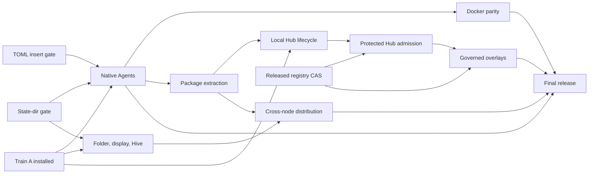

# Finishing Bee

This is the operational plan for the first complete Bee release. Bee is finished
when one installed executable is a dependable local coding desktop, can run
managed coding agents locally or in Docker, can join other Bees through the
native mesh, can install independently packaged components from Hub, and can
apply reviewed registry overlays through governance.

The implementation stays inside the boundaries already built:

- the workspace host owns applications and retained application state;
- a display owns presentation and layout, and an attachment owns live control or
  observation;
- threads own durable Agent communication and subscriptions;
- the native mesh and Hive supervisors carry cross-node operations;
- the Hub resolves immutable content but does not authorize it;
- governance decides protected changes and the registry owner applies them;
- native `exec.docker` is the only Docker execution path.

There will be no second mesh, Bee message-ingress API, alternate registry,
Docker control plane, or dependency on `../bee-legacy`. Production loads only
`src/`; tests and fixtures stay outside the pack.

## Current truth

The installed Train A executable has SHA-256 `4692e267` and source `414c03b`.
It is the rollback point. It passed offline boot, native Agent selection, scoped
Codex MCP/hooks, recovery, pack inspection and atomic installation.

The integration branch is `feat/docker-harness-delivery-20260913`. Grok B1.1 is
the immutable implementation base at `380d288`; later finish evidence builds on
it in bounded commits. This plan is the only finish queue for that branch. Older
handoff queues provide evidence and history but do not reorder this plan.
The current pushed integration head is `daec47c`. It includes the bounded Claude
credential projection, the selected-state manifest composition, the native
legacy-root preservation cut and the promotion handoff. Candidate artifacts
remain evidence until the promotion gate passes; they are not installed as
global Bee.

Completed on this branch:

- all four CLI aliases resolve the same managed definitions as the Agent picker;
- raw-argument and duplicate-alias bypasses refuse before admission;
- Claude and Codex inherit their normal global configuration additively;
- Agy and Grok additive configuration inheritance is complete;
- saved profiles are workspace-scoped, database-backed and revisioned; create,
  edit, select, tombstone, restart persistence and receipt replay pass;
- an exact-source standalone passes the four-provider selector, real Grok 1.0.30
  authenticated and clean/login/cancel/restart paths, graceful and abrupt
  fixture owner recovery, and real Agy, Codex and Grok cold conversation continuation;
- the direct native Docker PTY and lower placement foundations pass;
- the Hub already implements most of its local immutable
  install/update/remove, migration, receipt and recovery backend;
- workspace host/client, display, Hive, thread, gateway, governance and
  authoring foundations exist, but their final public journeys do not.

Grok B1.1 is committed. Its private retained configuration snapshots only an
approved user base, structurally inserts Bee's MCP section and refuses semantic
collisions or changed retained bases. Initializer digests bind before setup or a
ready marker becomes visible. The exact-source executable is
`/tmp/bee-grok-b11-final/bee` (SHA-256 `64679b3f...`) and uses runtime
`291f5c6b...`; the full Lua suite passes 893/893, strict lint passes with the one
existing `desktop_lifecycle` fixpoint warning, native window acceptance passes,
and global/project Grok trees remain unchanged. This is branch evidence, not a
global installation.

The immediate Agent gap is one row: real Claude recovery. Its checked target now
uses an optional host environment credential projection: absence preserves the
ordinary HOME/login path, while presence materializes `ANTHROPIC_API_KEY` only
into the admitted attempt and persists no bytes. The source-free selector and
the full 893-test suite pass. Installed Claude 2.1.270 reaches the first-party
provider, but the current account returns HTTP 400 `Credit balance is too low`
before inference, so the row remains externally blocked and unqualified.
Fixture Claude proves stable application, thread and retained HOME plus a fresh
attempt and gateway binding across graceful and abrupt owner restart. Durable
real-Agy, real-Codex and real-Grok acceptance proves exact tool-free recall after
source deletion, with stable conversation/HOME/application/thread and fresh
attempt and gateway identities. Codex also proves its command read and scoped
MCP/hook pairing; Grok
proves matching provider/hook conversation identity and scoped MCP. Their global
configuration remains unchanged. Agy, Codex and Grok now pass against the
selected-state candidate and need another live rerun only if the final promotion
commit, runtime or provider version differs. Claude metadata is reconciled only
when its authenticated row qualifies. Native Agents now awaits Claude and the
complete promotion gate.

The selected-state implementation has a composed, executable candidate:
runtime PR #747 (`6b40cb0`) adds the executable-selected default state directory,
builder PR #9 (`c1e6df6`) wires it from the single native launch component, and
Bee native `bd63538` derives `~/.config/bee/projects/<canonical-folder-hash>`
and preserves a legacy shared root through one protected project binding.
The candidate passes the two-folder, same-folder, explicit-client and explicit
`--state-dir` executable checks. It also passes the actual old-global upgrade and
rollback journey: it refuses while the old owner holds the root, binds the
legacy root once without copying or deleting a database, preserves workspace and
migration identities, isolates the second project, retains machine Hive state,
and lets the old binary reopen the original root. The global Train A executable
remains the rollback build.

### Active delivery board

This is the short operational view. A unit is complete only when its named
executable proof passes and its result is committed on the integration branch.

| Now | Parallel after the next promotion | Later dependency |
|---|---|---|
| Finish and independently audit `make promotion-check MILESTONE=native-agents` | Finish the local folder/display decision table and local topology UI | Public Hive waits for the released remote-lifecycle boundary |
| Run the immutable full check, standalone, pack inspection and installed-upgrade gates; run Claude when the provider account permits a turn | Extract one app as an independent Hub package and close its local lifecycle | Protected Hub publication and overlays wait for released registry compare-and-set |
| Atomically promote Native Agents after every required row passes | Compose saved profiles through native `exec.docker` with the same driver, thread and gateway | Connected distribution waits for local package extraction and connected topology |

No new feature enters the Native Agents promotion. Account refusal is reported
as a provider result; it does not send the implementation back into redesign,
but the four-provider Native Agents checkpoint waits for the row to qualify.

### Release plan at a glance

Bee advances through five installed checkpoints. Each checkpoint is a clean,
immutable commit with its own rollback receipt; work from later checkpoints may
run in parallel but cannot widen an earlier promotion diff.

| Checkpoint | User-visible result | Bee-owned work | External prerequisite |
|---|---|---|---|
| Native Agents | Offline project launch plus Claude, Codex, Agy and Grok from the picker or CLI with durable threads, scoped hooks/MCP and recovery | Seal the Claude projection gate, consume the state model, revalidate provider evidence against the final inputs and install atomically | released selected state root, TOML insertion and listener address; Claude account able to complete two turns |
| Local Components | Predictable folder/workspace/display behavior and one independently installed Hub app | finish local topology, extract one app package, close install/update/remove and protected admission | released registry compare-and-set for admission |
| Docker Agents | The same four saved profiles run through native `exec.docker` by changing only isolation | compose exact mounts, reconcile containers and rerun terminal/hook/MCP/recovery checks | released exact-attempt Docker mounts |
| Connected Bee | Two Bees discover, attach, observe, transfer control, install admitted packages and transfer a saved profile through the native mesh | finish public supervisor admission, remote placement, package/profile transfer and recovery | released remote actor lifecycle |
| Editable Bee v1 | User or Agent stages, reviews, approves, applies and rolls back registry overlays, including replicated approved changes | finish governance effects, receipts, rollback, overlay UI and replication; harden and tag | released registry compare-and-set and Connected Bee |

The active critical-path unit is the Native Agents qualification and promotion.
The state-root cutover, legacy preservation proof and Claude projection gate are
present at the pushed integration head. The Claude account refusal remains
an external qualification result; it does not stop the deterministic promotion
checks or the topology, Hub, Docker and package lanes. It does stop the final
Native Agents installation while that checkpoint promises four authenticated
harnesses.

### Next global promotion checklist

This is the complete queue for the next installed Bee. Do not add topology,
Docker, Hub or overlay changes to this candidate.

1. Retain the green runtime PR #747 and locally proven builder PR #9 pins through
   the manifest. Builder hosted jobs are blocked before startup by GitHub billing,
   so their local race/vet evidence remains the code proof. Retain the pinned
   structural TOML compatibility patch until runtime PR #746 has an accepted head.
2. Retain the implemented direct legacy-root binding and its executable proof
   against the installed global binary. It keeps the old root intact for rollback
   and gives other projects hashed roots.
3. Build from one clean integration commit. Run offline two-folder launch,
   explicit state override, same-folder reuse, multi-display/client, source and
   packed Agent selection, and cold/restart/crash recovery.
4. Retain the exact-commit Agy, Codex and Grok evidence, rerunning a row if the
   final commit, runtime or provider version differs. Run Claude's full fixture
   row and its real authenticated row when account access is available;
   otherwise record the exact provider refusal without treating it as a Bee
   regression or claiming the four-provider checkpoint.
5. Add the milestone-aware promotion target described below, then run full
   lint/check, pack inspection, old-global upgrade and atomic-install
   acceptance. Install globally only from the tested commit and write its six-file
   rollback receipt.

The promotion is usable when ordinary `bee` starts offline in the current
folder, the picker and CLI launch all four installed harnesses with their
normal global configuration plus scoped Bee hooks/MCP, and all existing user
state remains available. A provider refusal is reported accurately; fixture
evidence cannot claim an authenticated turn or satisfy this checkpoint.

### Reusable runtime gates

Bee implementation continues while these reusable runtime proofs are completed
in separate PRs assigned to `skhaz`:

1. **Selected default state directory.** Runtime PR #747, stacked on the
   embedded-baseline branch, supplies the optional executable-selected default;
   builder PR #9 carries it from the same native component that owns launch.
   The executable supplies one default state root to every database/resource
   declaration; explicit `--state-dir` takes precedence. Existing explicit
   paths retain their meaning. Promotion also requires Bee's one-time legacy
   state mapping/import proof; the runtime primitive alone does not provide it.
2. **Atomic registry compare-and-set.** Hub publication and overlay activation
   can bind a write to the reviewed registry revision. A concurrent writer causes
   a conflict before publication.
3. **Remote actor lifecycle.** Native mesh acceptance proves authenticated public
   enrollment/discovery, exact remote actor exit delivery, destination restart and
   same-name rejoin without a Bee remote-monitor subsystem.
4. **Narrow structural TOML insertion.** Grok private configuration uses the
   reusable `toml.insert(document, path, source)` operation. Runtime PR #746 is
   assigned to `skhaz`. The finish branch and runtime handoff currently name
   different candidate digests; the runtime owner must provide one accepted
   commit, patch digest and proof command before promotion. Bee does not expose
   general TOML parsing or carry a private copy of the codec.
5. **Authoritative OS-assigned HTTP address.** Managed MCP binds port zero and
   receives the actual listener address from the runtime owner; Bee never probes
   and races on a guessed free port.
6. **Exact Docker attempt mounts.** Native Docker execution accepts the measured
   per-attempt project, private HOME and admitted input mounts and supports
   reconciliation without granting Docker authority to Agent code.

The next global promotion requires gates 1, 4 and 5. Docker Agents additionally
requires gate 6. Connected Bee requires gate 3 and supervisor-host admission.
Hub admission and governed activation require gate 2. Candidate binaries may be
used for acceptance, but Bee does not merge these runtime PRs.

Before implementation claims depend on these gates, copy each accepted runtime
pin, digest, proof command and remaining limitation into
`docs/handoffs/STATUS_RUNTIME_GATE.md`. The finish plan orders work; that handoff
is the canonical runtime evidence.

Supervisor-host admission is a Bee-owned integration seam over the existing
native mesh, not another runtime API. Its connected-release gate is
`make hive-supervisor-check hive-desktop-admission-check native-hive-catalog-check`
against the accepted remote-lifecycle runtime pin, followed by the public
enrollment journey below. Any newly reproduced runtime gap remains a separate PR
assigned to `skhaz`.

## Definition of finished

These six journeys must pass from one tagged executable:

1. **Open locally.** `bee` starts offline in the current folder without waiting
   for Hive, restores the correct project workspace, and gives each client an
   independent durable display.
2. **Run an Agent.** The picker and `bee claude|codex|agy|grok` run the user's
   ordinary installed harness with its global behavior intact, plus admitted Bee
   instructions, hooks and MCP. Each window has one durable thread and predictable
   close, restart and recovery behavior.
3. **Change isolation.** The same saved profile runs locally or through native
   `exec.docker`. Identity, thread, project, tools, terminal behavior and recovery
   stay the same; only isolation changes.
4. **Join a Hive.** Two real Bees connect through the native mesh, show clear
   Hive/node/workspace/display state, retain applications when a client leaves,
   and support controller transfer and observers.
5. **Install a component.** Modules plans, reviews, installs, updates, recovers
   and removes an immutable app or independently packaged harness. A destination
   Bee can install admitted content without receiving the source Bee's authority,
   credentials, processes or mounts.
6. **Edit safely.** A user or Agent stages an exact-revision overlay, reviews its
   source and capability changes, submits protected effects to the right inbox,
   and the registry owner applies or rejects it once. Apply and rollback have
   durable receipts.

### Release scoreboard

This table is the progress view. A journey moves to **ready** only when its
installed-executable acceptance passes; source code or a fixture alone is
**partial**.

| Journey | State | Remaining release boundary |
|---|---|---|
| Open locally | partial | executable-selected state root for every store; offline folder and multi-display installed proof |
| Run an Agent | partial | durable four-provider cancel/restart/crash recovery matrix and selected-state-root promotion gate |
| Change isolation | foundation | compose the same saved profiles through native `exec.docker`; reconcile and recover containers |
| Join a Hive | partial | public enrollment/discovery, project-node selection, controller transfer, remote placement and two-real-runtime recovery |
| Install a component | partial | close local Hub lifecycle, protected admission and independently packaged app/harness proofs |
| Edit safely | foundation | complete the governed stage/review/apply/receipt/rollback journey over released registry CAS |

## Critical path

The implementation lanes can run in parallel. Their release gates are
sequential and use immutable commits.

Folder/display/Hive work does not depend on finishing Agents. Local overlay work
does not depend on cross-node distribution. Package distribution and overlay
activation converge only at the final release.

## Immediate execution queue

This queue turns the parallel lanes into reviewable promotions. A later item may
be implemented early when it does not share mutable files, but the global binary
advances only at the named promotion.

| Order | Lane | Work unit | Ends when |
|---|---|---|---|
| 1 | Agents before runtime cut — complete | Retain pushed commit `1254ba4`, the passing Agy, Codex and Grok evidence, and Claude's exact external account refusal without claiming qualification | The pre-cut branch stays immutable and every provider keeps a named recovery target and exact evidence or one named external blocker |
| 2 | Runtime integration — complete candidate | Retain the proven legacy-root cutover and selected-state composition; reconcile accepted upstream pins without changing the state model | Offline launch from two folders isolates project state, explicit `--state-dir` wins, legacy state binds once, and upgrade plus rollback preserve all owned data |
| 3 | Agents after runtime cut / active | Finish the milestone promotion target, revalidate provider rows whose commit/runtime/version inputs changed, qualify Claude, then promote **Native Agents** | Full check, standalone, offline/restart/recovery, provider matrix, pack inspection and atomic install pass; this becomes the new rollback point |
| 4 | Local topology | Finish folder selection, durable displays, immediate offline presentation, F9 local topology and controller transfer on the selected state model | Same-folder clients get predictable displays, distinct folders get distinct project state, local boot never waits for Hive, and retained applications survive client replacement |
| 5 | Package foundation | Prove the native runner/dataflow path, freeze accepted schemas and complete Plan 5's local package-extraction slice | One headless runner turn passes; host and standalone app/harness closures behave identically with no duplicate IDs |
| 6 | Hub | Close local immutable install/update/remove for an extracted app, then protected admission using released registry compare-and-set | One independent app package can enter and leave the catalog without a core edit or authority leak |
| 7 | Release | Promote **Local Components** | Correct local folder/display behavior and admitted local Hub components pass together from a clean executable |
| 8 | Docker | Route the same four saved profiles through native `exec.docker` and the existing carrier/gateway | Local and Docker differ only by isolation; lifecycle, terminal, hook, MCP, recovery and secret checks match on Linux and Docker Desktop/WSL |
| 9 | Release | Promote **Docker Agents** | All four real providers pass native and Docker profile acceptance from one executable |
| 10a | Local overlays | Complete local `stage -> inspect -> submit -> decide -> apply -> receipt -> rollback` over released registry compare-and-set | Exact-revision apply, protected approval, stale refusal and rollback pass for user and Agent edits |
| 10b | Connected topology and distribution | In parallel with local overlays, finish public enrollment/discovery, remote display attachment and placement, then transfer admitted immutable app/harness packages and saved profiles through the native mesh and Hub receipt model | Two real runtimes pass selection, controller/observer rejoin, remote child/carrier/gateway/PTY, destination policy re-resolution, and package/profile install/restart/update after sleep, lost acknowledgments and destination restart |
| 11 | Release | Promote **Connected Bee** | Public enrollment/discovery, remote selection, placement, approvals, retained apps, package delivery and saved-profile transfer pass between two real Bees |
| 12 | Release | Replicate approved overlays, promote **Editable Bee v1**, then harden and tag | All six finished journeys pass twice on the target platform matrix and the website/docs match the tagged executable |

The integration owner keeps the critical path on orders 1 through 3 while the
topology, Hub/package and Docker lanes work independently on orders 4, 5, 6 and
8. No lane adds a replacement mesh, registry, Docker service or Bee-specific
runtime API.
The existing host/client and single-controller acceptance is a retained
prerequisite for Native Agents: every Agent promotion reruns it and may not
regress independent display state, stale-controller fencing or retained apps.
Governed overlay implementation may start as soon as local Hub admission and
released registry compare-and-set are stable; only overlay replication waits for
Connected Bee.

### Live execution board

This board is the current handoff into the ordered queue. It names the next
bounded result in each lane; detailed evidence remains in the implementation
status and handoff documents.

| Lane | State | Next bounded result | Dependency |
|---|---|---|---|
| Agents / integration | active after state cut | Finish the exact promotion receipt and immutable gate; qualify Claude when account access is available | accepted selected state root, structural TOML insertion and OS-assigned listener address for global promotion; usable Claude account for its row |
| State | executable candidate complete | Preserve native `bd63538` and the passing current-global upgrade gate while upstream pins are reviewed | runtime #747 is green; builder #9 has local race/vet proof and hosted billing blockage |
| Topology | ready in parallel | Prove immediate offline presentation, independent durable displays and asynchronous Hive rejoin before extending the two-node journey | released state root for promotion; remote actor lifecycle for public connected use |
| Hub | ready in parallel | Close one local immutable app install/update/remove journey with protected admission and recovery | released registry compare-and-set for final publication |
| Docker | queued behind Agent contract | Run one saved profile through native `exec.docker` with the same thread, hooks, MCP and recovery identity | qualified native provider row; no userspace or AppArmor dependency |
| Packages / distribution | queued | Extract one app and one harness package, then deliver admitted immutable content to a second Bee | local Hub lifecycle and two-node topology |
| Overlays | queued | Complete governed `stage -> inspect -> submit -> decide -> apply -> receipt -> rollback` | local Hub admission and released registry compare-and-set |

The first usable global update is deliberately smaller than finished Bee: it is
the Native Agents checkpoint. Its remaining local work is the clean post-cut
promotion gate. The runtime/state cut, legacy-state preservation and Claude
credential/recovery gate are pushed at `daec47c`. Real Agy 1.2.2, Codex 0.154.0
and Grok 1.0.30 cold recovery pass against the selected-state candidate. The current real
Claude acceptance opens its managed window and reaches the first-party provider,
which refuses inference because the account balance is too low; its row remains
unqualified until the account completes both turns. Agy, Codex and Grok real
cold-recovery rows pass. No Hive, Hub, Docker or overlay work is
allowed to enlarge this integration diff.

### Current bounded unit

The selected-state unit and the post-cut Agy, Codex and Grok rows are complete;
real Claude has one named external blocker. The current unit is only Native
Agents qualification and promotion:

1. finish `make promotion-check MILESTONE=native-agents` as a thin composition
   of existing named gates with an exact, reproducible receipt;
2. independently verify that the receipt binds the build manifest, provenance,
   runtime, provider inputs and actual packed registry contents to one clean
   commit;
3. run Claude's fixture recovery now and its authenticated two-turn row when
   account access is available;
4. run the full repository, standalone, pack, upgrade and atomic-installer gates
   from one clean commit, then install it as the new rollback point.

No unrelated refactor, UI polish or new provider abstraction enters this unit.
Install globally as soon as the clean four-provider promotion gate passes.

### Execution discipline

- Finish user-visible vertical slices before reorganizing working code. Remove
  obsolete POC and fallback paths only after their replacement journey passes.
- Keep at most four implementation lanes active: Agents, topology, Hub and
  Docker. Use additional agents for bounded acceptance, review and independent
  files, with one integration owner resolving shared seams.
- A lane reports progress only as a passing acceptance proof, an immutable commit
  ready to integrate, or one precisely reproduced blocker with an owner.
- Build the global executable only from a clean immutable integration commit.
  Never promote a dirty worktree or bypass a failing production lint gate.
- Prefer existing runtime, mesh, registry, thread, gateway and `exec.docker`
  primitives. A new abstraction must remove duplicated authority or lifecycle
  logic and must have a current consumer.

### Delivery windows

These are focused engineering windows after their named runtime prerequisites
exist. They are planning ranges, not release claims.

| Promotion | Remaining focused work | External gate |
|---|---:|---|
| Native Agents | 1–2 focused days | accepted state-root, TOML insertion and listener-address runtime cuts; usable Claude account |
| Local Components | 3–5 focused days after Native Agents | registry compare-and-set for protected admission |
| Docker Agents | 2–3 focused days after Native Agents; may overlap Local Components | exact Docker attempt mounts runtime cut |
| Connected Bee | 3–5 focused days after Local Components and package extraction | remote lifecycle and stable two-node package transfer |
| Editable Bee v1 | 4–7 focused days after Connected Bee and Docker Agents | released registry compare-and-set |

Every implementation window ends at a disposable candidate executable and user
journey. Only a named promotion row updates global Bee. A lane that misses its
acceptance proof does not consume release time through polishing or unrelated
cleanup; its failing boundary becomes the next bounded work unit.

With the runtime gates available and topology/Hub/Docker work kept parallel, the
estimated critical path is 11–19 focused engineering days. The first usable global
promotion, Native Agents, has 1–2 focused engineering days of local work; its
calendar date also depends on the runtime cuts and a usable Claude account.

## Work plan

### 0. Freeze state selection and release runtime pins

Before the next global promotion, make the executable-selected folder derive one
default state root for all Bee databases and retained resources. Explicit
`--state-dir` wins. Prove old default state imports without deleting it, two
folders remain isolated, and profiles, conversations, threads, Hub receipts,
workspaces and displays survive restart and a binary upgrade.

Write one store-selection matrix before changing paths. For every store it names
the owner, whether it is project-selected, user-shared or explicitly overridden,
its import source and its restart/upgrade rule. The inventory includes every
SQLite declaration and derived client database, registry history, placement and
native-mesh state, deployment/artifact caches, and retained attempt/session
homes. Shared registry history and authorized overlays must not silently become
empty merely because a project folder changes. Every database and retained
resource declaration follows the matrix; no service derives an alternate private
root.

The selected cutover is a direct mapping rather than a copy. The
machine-shared Hive enrollment remains at `~/.config/bee/local-hive`. The first
project cutover durably binds the legacy runtime root to exactly one canonical
project after proving the old owner lock is free. It never copies live SQLite
files, reselects from the current directory after the receipt exists, or binds
the legacy root to several projects. The strict receipt records the canonical
project, legacy root and mapping mode; the executable gate inventories every
owned store and registry history. Replaying the cutover returns the same result.
A malformed, busy or conflicting cutover refuses and leaves the legacy root
usable by the rollback binary.

The executable upgrade acceptance starts from a copy of the current global
state and old global binary, creates representative profiles, conversations,
threads, Hub receipts, workspaces, displays, overlays and registry history, then
launches the candidate from the bound project twice. It verifies stable IDs and
content, unchanged migration ledgers, no state in a second project, explicit
`--state-dir` precedence, rollback readability, and an idempotent cutover receipt.

Exit proof: the installed executable opens the intended folder offline and every
store resolves beneath the selected root, a documented user-shared root or its
explicit override. The accepted runtime also supplies structural TOML insertion
and the authoritative port-zero listener address. After this exit proof, build
one immutable candidate and rerun the complete provider matrix against those
exact released pins; the matrix is the next promotion step, not a prerequisite
for consuming the runtime cut.

### 1. Finish native Agents

This is the immediate lane and the shortest route to the next useful global
build.

1. Retain the completed Grok private composition and saved-profile storage as
   prerequisites. Do not reopen them unless the provider matrix reproduces a
   defect. The public profile remains:

   `profile = harness + isolation + options + MCP scope`

   Stored additional instructions are profile data. Dynamic context and any
   function-built instruction text are resolved at admission and never become
   stored authority. Bee adds instructions to provider behavior; it does not
   replace the provider's built-in system prompt.
2. Complete clean-install default-profile acceptance through both the picker and
   CLI. Existing create/edit/select, revision CAS, tombstone, restart and replay
   behavior remains a regression gate.
3. Give the managed gateway an OS-assigned listener address and every attempt a
   distinct action URL/binding and per-attempt secret. The listener may be shared;
   attempt identity and authority may not be. The
   callable surface is the intersection of saved profile scope, host policy and
   the request's dynamic `ctx`; ports, secrets, grants and `ctx` are never durable
   profile data. Hooks and MCP bind to the same attempt and thread. Prove two
   simultaneous attempts get distinct action bindings and secrets, cross-attempt
   calls refuse, and a retired attempt cannot call after restart.
4. Bind every provider window to one durable thread, committed activity/title
   state and subscription cursor. The disconnected surface keeps the last
   confirmed value; Timeline resumes its cursor; Inbox distinguishes empty from
   unreachable. Prove presenter replacement, client reattachment and owner/host
   restart separately.
5. Prove cold recovery for all four installed providers. Reconcile a surviving
   child before starting a replacement; otherwise start a fresh attempt against
   the provider's durable conversation identity without replaying the original
   prompt. Login, subscription and account refusals remain visible provider
   outcomes and do not count as authenticated qualification.
6. Give every row a checked-in live recovery target. All four now have named
   targets. Rerun all four
   after consuming the released state-root/runtime cut, because moving retained
   stores can invalidate earlier recovery evidence.

Maintain a four-row provider matrix. Each row requires a real installed binary,
real configuration composition, MCP/hook delivery, close/cancel and restart. It
tests present and absent user configuration, preserves provider-specific login
state and user hooks, and fingerprints the provider's global and project trees
before and after. When credentials exist it also requires an authenticated
startup and turn; otherwise the row records the provider's explicit login/account
refusal and remains unqualified. Native Agents promotion requires all four rows
to be authenticated and qualified. No secret, endpoint or
grant may appear in argv, records, logs, retained homes or the pack. Fixture-only
evidence never marks a provider working.

Exit proof: UI and CLI launch all four real harnesses; global settings remain
intact; scoped MCP and hooks reach the bound thread; cancel, close, restart and
resume work; pack inspection finds no credentials or fixtures.

### 2. Make folder, display and Hive behavior coherent

1. Consume the state-root decision from Plan 0 without deriving alternate paths
   inside Bee services.
2. Implement one public launch decision table:
   - `bee` in a new folder creates or reuses that project node/workspace and a
     current-terminal display;
   - another `bee` in the same project attaches or creates an independent display
     according to explicit controller rules;
   - explicit client/observe commands attach to a selected existing display and
     do not change the project selection.
   Distinct folders retain distinct project-node and workspace identities. A
   selected remote destination creates state there; losing it reports unavailable
   and never creates a local clone with the same identity.
3. Present the local desktop immediately. Hive join and rejoin run asynchronously.
   A remote node may remain connectable for 60 seconds, while local input, cancel
   and exit stay responsive.
4. Implement public enrollment, discovery and selection. `bee hive init` creates
   the first protected machine configuration and one bounded invitation;
   `bee hive join <invitation>` consumes it once and persists the admitted trust
   decision; `bee hive key` mints a later bounded invitation. Expired, replayed,
   foreign and unauthorized invitations refuse. Trust updates take effect
   without treating LAN discovery or transport identity as user authority. The
   workspace/display switcher uses supervisor admission over the native mesh.
5. Stop representing physical clients as durable Hive nodes. Displays have stable
   friendly identities, attachments have leases and generations, stale displays
   retire gradually, and retained applications/layout survive client loss.
6. Finish the compact shell switcher and F9 topology view. Show Hive service,
   executing node, workspace, display, controller/observer state and precise
   reachable/unavailable/unauthorized status without polling dead clients.
7. Implement safe `Send to display`: revoke or fence the previous controller
   before granting the next one; allow many observers; never let an uncertain
   result create two input controllers.
8. Prove two actual Bee runtimes over the existing native TLS mesh, including
   sleep/rejoin, remote viewport, resize/input, approval and retained apps.
9. Prove the built-in headless node profile: start without a TTY, complete work
   without a client, attach a display later, detach it, and continue running.
   This uses supervisor admission and the same workspace owner as interactive use.

Public Hive activation waits for the reusable remote-lifecycle gate. Internal
loopback fixtures may develop the UI and protocol earlier, but they do not make
enrollment, discovery or remote attachment callable in a promoted executable.

The **local topology slice** ends when offline folder boot is immediate, several
clients/displays behave predictably, stale records retire and retained apps
survive client replacement. It is part of Local Components and does not wait for
public Hive enrollment. The **connected topology slice** ends when the two-node
native-mesh journey passes; it is part of Connected Bee and requires the remote
lifecycle gate.

### 3. Qualify local Hub and package components

1. Treat the current Hub backend as implemented foundation. Close its remaining
   combined regression and native lifecycle evidence instead of rebuilding its
   planner, migration or receipt model.
2. Measure and bind the exact dependency/artifact closure, configuration
   parameters, migration bodies/effects and destination requirements before
   review. A missing or changed input invalidates the plan.
3. Require the released generic registry compare-and-set operation for every Hub
   publication. The current single-writer revision check is foundation evidence,
   not the final concurrent-writer guarantee.
4. Add the missing protected admission effect owner. Hub publication installs
   immutable definitions; it never grants their capabilities. An unadmitted app
   stays out of Tools and direct open refuses.
5. Bind approval to the exact artifact, definition digest, registry revision and
   host-selected capability set. Revalidate all four before the registry owner
   publishes the admission effect. The requester cannot approve its own protected
   install, and a consumed decision cannot authorize a second effect.
6. Prove lost acknowledgments, injected migration/install failures, process
   restart and worker takeover. Resume from durable receipts without manually
   applying migrations or repeating committed effects.
7. Preserve service-owned application configuration and state across update and
   restart. Registry metadata remains declarative; app data remains in its owning
   database.
8. Keep Claude, Codex, Agy and Grok as independent declarative components. This
   local Hub milestone proves one already extracted app package end to end. The
   four harnesses retain separate definitions and namespaces here; their
   independent package install/update/remove proof follows package extraction in
   Plan 5 rather than being inferred from their embedded source layout.

Exit proof: clean and populated stores pass one independently packaged app's
install/update/remove, migration execution, interrupted-operation recovery,
admission/revocation, restart and pack inspection. The Modules UI plans, reviews,
confirms and applies the exact operation. A host-selected approver can decide a
protected install; absent approver policy and requester self-approval both
refuse. Harness package parity remains an explicit Plan 5 gate.

### 4. Complete Docker as a profile choice

1. Install one default Docker profile per available harness component and expose
   it in the Agent picker, saved-profile editor and CLI selection. Unavailable
   Docker reports a precise readiness state without hiding the local profile.
   The first component source now exists for Codex outside the default pack. It
   contributes `codex-docker` through the ordinary definition catalog and has
   mandatory Hub parameters for an immutable image and non-root user. Its linker
   and catalog acceptance passes; publishing dependency pins, a real Codex image,
   readiness reporting and the other three harness components remain.
2. Route the existing carrier and managed-window lifecycle through the native
   `exec.docker` placement binding. Keep the same attempt owner, sweeper, thread,
   driver and gateway. Do not depend on the optional userspace Docker component.
3. Keep session mode and interactive-window mode explicit. One request owns
   exactly one measured execution/container identity; a PTY does not imply
   structured ACP or RPC behavior.
4. Record creation intent before dispatch and label containers with exact
   owner/action/attempt identity. Implement start, stop, inspect, reconcile and
   cleanup, including surviving-container recovery, daemon restart and explicit
   daemon-unavailable behavior.
5. Run the normal installed harness command. Mount the selected project and the
   minimum approved configuration/credential inputs. Keep Bee material and
   writable harness state in attempt/session storage. AppArmor is optional.
6. Expose the same randomized authenticated MCP/hook endpoint to the container;
   intersect profile scope, host policy and dynamic context at admission.
7. Refuse when a profile's required hardening is unavailable; portable profiles
   use non-root execution, dropped capabilities, the daemon's seccomp policy,
   bounded resources and only their admitted mounts.
8. Prove PTY input/output/resize, close, cancellation, create/start failures,
   owner restart, container removal and absence of secrets from argv, records,
   logs, container inspection and the production pack on Linux Engine and Docker
   Desktop/WSL. Record before/after hashes for the user's global and project
   provider configuration trees. Prove Local and Docker private homes have the
   same create, retain, reuse and cleanup rules while neither path modifies the
   user's source configuration.

Run the same four-provider configuration matrix as native placement: ordinary
installed harness behavior and login state remain available through only the
admitted mounts/projections, provider trees remain unchanged, and a local profile
switches to Docker without changing its thread or MCP/hook scope.

Exit proof: changing only `isolation` from Local to Docker preserves the Agent's
identity, project, thread, tools, hooks, terminal and recovery behavior for all
four providers.

### 5. Extract packages, then place and distribute through Hive

1. Prove the native runner without a PTY or MCP shortcut: one admitted headless
   turn and a two-node dataflow settle use the same request, delivery and receipt
   queries as interactive Agents.
2. Freeze accepted schema revisions and extract app and harness closures into
   independently mounted packages. The host assembly and minimal standalone host
   must behave identically; reject missing requirements and duplicate definition
   IDs. Production `src` consumes packages through declared dependencies.
   Claude, Codex, Agy and Grok must each install, update, remove and pass their
   qualified native launch journey as an independent Hub component.
3. Complete destination admission and remote placement for child, carrier,
   gateway and PTY. Prove destination restart, same-name rejoin, Mac sleep,
   revoked attachments, lost launch acknowledgments and remote approvals without
   inferring authority from mesh membership.
4. Transfer content-addressed immutable package data through supervisor-selected
   native-mesh operations. Reuse the Hub plan and receipt types; do not create a
   second installer or transport.
5. The destination independently resolves policy, reviews capability changes,
   admits and installs. Transfer package bytes and declared filesystem resources;
   never transfer credentials, grants, PIDs, live mounts or database ownership.
6. Transfer a saved Agent profile only with its definition/profile revision,
   options and declared MCP scope. The destination re-resolves its own harness,
   policy, credentials and dynamic context; source login state, human identity and
   authority never ride with the profile.
7. Add retry/restart recovery around content chunks and install receipts. A fat
   storage Bee is a role expressed by installed components and admitted
   interfaces, not a special topology.
8. Prove one app and one harness move to a second node, install, launch, restart
   and update while the source can disappear after transfer.

Exit proof: independently mounted packages behave the same as the host assembly;
another Bee remotely runs an admitted Agent and gains usable components from
immutable admitted content with no core edit or authority leakage. Inspected
content and receipts contain no source credentials, grants, PIDs, live mounts or
database ownership, and the destination derives none of them from membership.

### 6. Finish governed overlays and Agent-authored edits

Implement the public governed `bee:publish` owner interface for user edits, Agent
edits and installed overlay content over the existing authoring, approvals and
registry foundations. Its callable operations are `stage`, `validate`,
`activate`, `status` and `rollback`; UI and narrow Agent MCP tools project the
review and decision state around those owner operations. Until this section's
acceptance passes, these operations remain proposals rather than published APIs:

`stage -> inspect -> submit -> decide -> apply -> receipt -> rollback`

Freeze the exact operation schemas before implementation. In the journey,
`stage` creates the candidate; `inspect` reads `validate` plus `status` without
authority; `submit` creates the exact approval request; `decide` belongs to the
governance owner; `apply` invokes registry-owner `activate`; `receipt` is the
durable committed result returned by `status`; and `rollback` is a new authorized
compare-and-set effect. UI labels and MCP tools may use the journey verbs, but
they do not create additional owners or publication paths.

1. Store the staged candidate durably with base registry revision, entry digests,
   exact dependency/artifact closure, parameter bindings, source, migration
   bodies/effects, declared capability changes and target scope. Staging grants
   nothing.
2. Show a review that distinguishes code/data changes, capability changes and
   protected core targets. Bind an inbox item to the exact candidate digest and
   effect.
3. The governance owner decides. The registry owner alone performs compare-and-set
   activation against the reviewed revision. A stale review conflicts and cannot
   silently replan.
4. Record applied revision, changed definitions and inverse data required for
   rollback. Rollback is another authorized compare-and-set operation.
5. Recover from lost apply acknowledgments, process restart and worker takeover
   using durable receipts. Refuse self-approval, replayed decisions and any
   candidate whose artifact, closure, migration or reviewed revision changed.
6. Expose stage, inspect, status and submission through narrow Agent MCP tools.
   Agents never receive direct registry publication authority.
7. Replicate approved declarative overlays through the same package/content path.
   Service-owned databases and thread data keep their existing owners.

Editable Bee v1 admits declarative registry/package changes. Untrusted execution
against authoring filesystem mounts remains disabled until the existing symlink
containment failure has a passing host-directory acceptance proof.
Autonomous in-app source modification remains a later milestone; v1 lets an
Agent prepare and submit a declarative edit but never bypasses review,
governance or the registry owner.

Acceptance exercises the same candidate through the Modules UI and narrow Agent
MCP tools. It includes two concurrent apply attempts against one base revision,
replayed and stale approvals, a direct Agent publication attempt, visible partial
failure status, owner restart between commit and reply, receipt recovery after
restart, and rollback of supported migration effects. A running owner keeps its
admitted old code until the documented authorized restart or rejoin loads the new
revision.

Exit proof: an Agent prepares an ordinary edit, the user reviews it, the owner
applies it once, protected changes require the configured approver, stale edits
refuse, and rollback restores the measured prior definitions.

## Global promotion checkpoints

Global Bee is updated only from a clean immutable integration commit. Docker does
not hold back a qualified native Agent build; later work continues in isolated
branches.

| Checkpoint | User-visible result | Required work |
|---|---|---|
| Native Agents | Correct offline folder state plus four authenticated managed harnesses, profiles, threads and recovery | Plans 0 and 1; released state-root, TOML insertion and listener-address pins; final-input provider evidence |
| Local Components | Correct folders/displays and admitted local Hub components | Plan 2 local topology slice and Plan 3 |
| Docker Agents | The same four profiles work through native Docker | Plans 1 and 4 |
| Connected Bee | Public two-node Hive, remote Agent placement, saved-profile transfer and cross-node app/harness delivery | Plan 2 connected topology slice, Plan 3 and Plan 5; released remote-lifecycle and supervisor-host admission pins |
| Editable Bee v1 | Cross-node component delivery and governed overlays | Plans 1–6 |

Each promotion runs:

1. `make lint` and focused behavioral acceptance;
2. source and packed user journeys, including standalone source/pack isolation;
3. one full `make check` with the exact pinned runtime, including
   `tests/native_binary.py`, `tests/recovery.py` and the detached lifecycle gate;
4. a fresh standalone build and offline/restart/recovery checks;
5. production-pack inspection for tests, fixtures, credentials and local state;
6. an installed upgrade that preserves registry history, admitted overlays and
   every owned database, then proves a fresh owner loaded the new executable;
7. an atomic six-file install with a recorded rollback receipt.

Before the first promotion, add one milestone-aware `make promotion-check` target
that invokes the required focused and installed-executable gates rather than
assuming `make check` includes them. Native Agents includes native binary,
detached lifecycle and all four live provider recovery targets. Later milestones
add Docker lifecycle/profile, Hub lifecycle/admission, two-runtime Hive, package
distribution and governed publication gates. The target writes the exact commit,
runtime pins, provider versions and invoked commands into the promotion receipt.
The target fails closed on a dirty or changed commit, missing or mismatched
runtime pins, missing required provider evidence, provenance/manifest mismatch
or an incomplete production-pack audit. It never installs or stops the global
Bee; installation is a separate step allowed only after the complete receipt
has been written and independently checked.

The six installed files are `bee`, `bee.LICENSES.txt`, `bee.go.mod`,
`bee.go.sum`, `bee.provenance.json` and `bee.runtime-patches.tar.gz`.
Every promotion preserves all databases, profiles, conversations, workspaces and
displays. Running owners may retain loaded code; acceptance of a new build uses a
fresh owner.

## Ownership and runtime boundary

Four implementation lanes may run concurrently: Agents, Docker, topology and
Hub. Distribution begins after topology and independently packaged Hub components
pass. Governed overlay work can begin after local Hub admission is stable and the
registry compare-and-set primitive is released.

Every unit has one editing owner, one bounded diff and one named executable exit
proof. Read-only audits can run in parallel. The integration owner accepts only
immutable commits with focused evidence, resolves conflicts, runs the release
gate once and performs global installation. Work that does not close a user
journey or an exit proof is deferred.

Any runtime semantic change is a separate runtime PR assigned to `skhaz`. Bee may
test against a pinned candidate, but it does not merge runtime PRs or carry a
private replacement API. Runtime changes are limited to reusable primitives;
Bee-specific policy stays in Bee.

## Final hardening

After all six journeys pass together:

- remove dead POC, fallback and superseded release paths;
- verify no test-only entries or fixtures are in production packs;
- measure cold/warm startup, idle CPU/goroutines/memory and bounded shutdown;
- run Linux amd64/arm64, macOS amd64/arm64, WSL, Docker Engine/Desktop and
  two-host Hive acceptance twice;
- audit migration from existing global databases and injected rollback failures;
- update implementation docs and `bee.wippy.ai` so claims and MIT notices match
  the tagged executable exactly.

ACP, pi RPC and additional provider transports follow v1 as independently
installable components. The v1 plan does not claim those semantics from a PTY or
delay the six release journeys on them.

No architecture-count test is a release gate. No database is deleted to make a
migration pass. Design proposals become implementation status only after their
public journey and executable acceptance exist.
