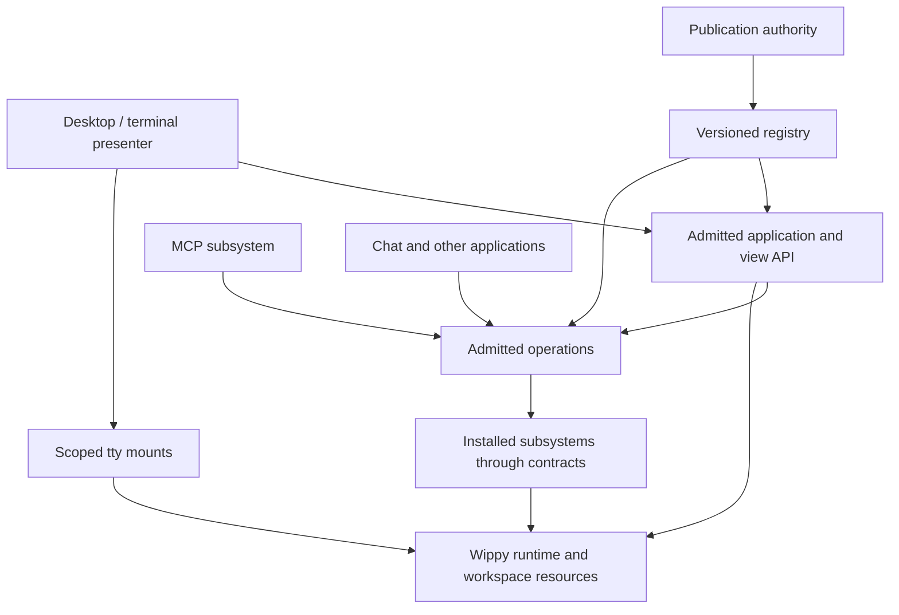

# Bee desktop foundation

Status: long-term production design, based on source study on 2026-09-07.
The current narrowed scope and native-core/user-overlay update decision are in
[FOUNDATION_STATUS.md](FOUNDATION_STATUS.md).
This is a design and delivery contract, not a claim that the production system
exists. It incorporates the latest decision: build the desktop first, replace
the POC cleanly, and keep domain subsystems independently installable.
It supersedes the earlier “evolve the POC” implementation order in
ARCHITECTURE.md and PLAN.md. Local Bee's small-start and persistence principles
remain applicable. Existing `casha.*` identifiers remain migration inputs;
renaming identifiers is not the architecture project.

## Product boundary

Bee is a workspace operating environment. Its desktop is a replaceable client
and presentation system. Opening the desktop must not require an LLM provider,
MCP, chat, Promptmap, a KB, or a workflow engine.

A user can start in a folder, open a terminal or application, move and resize
views, inspect work, detach, and return. An application can run without any
window. An agent can invoke the same admitted application operations without
simulating mouse clicks. A different shell can present those same resources.

The first production release is a small excellent desktop with Terminal,
Processes, appearance settings, and fixture applications. The fixtures are
explicit demo packages and are excluded from the minimal production pack.

## What belongs where

“Core” means a small set of enforced invariants, not every useful service and
not a single process holding every subsystem's state.

| Owner | Owns | Must not own |
|---|---|---|
| Wippy runtime | Process scheduling, execution primitives, scopes, registry/history, contract dispatch, tty surfaces/mounts | Bee layout, chat semantics, model selection |
| Workspace host | Workspace identity, state locations, boot composition, authenticated local attachment, resource bindings, recovery entry point | Domain behavior or window painting |
| Application authority | Admitted definition lookup, instance creation/reuse, view creation/attachment, lifecycle requests | Domain tables, driver-specific CLI flags, desktop placement |
| Desktop session | Window placement, z-order, focus, capture, navigation, presentation preferences and layout history | Starting arbitrary executables, credentials, provider setup, registry publication |
| Terminal presenter | Virtual desktop surface, scene rendering, input routing, local drag preview | Physical terminal lease, application identities, job ownership, durable writes on every frame |
| Physical terminal adapter | Stable physical lease, forwarding input to the active presenter, presenting its complete frames | Window layout, application rendering, domain behavior |
| Optional UI library | Bounded layout, text measurement/wrapping, focus navigation, scroll regions, controls | Mandatory app framework, business state, process lifecycle |
| Thread subsystem | Durable conversations/events, correlation, participants and admitted delivery | Windows, MCP transport, provider-specific session formats |
| Local chat application | Conversation selection, composer, transcript and local-agent UX | Grant issuance, all external harnesses, global process table |
| External-agent subsystem | Harness sessions, resume references, normalized turns and driver capabilities | Desktop core or MCP authorization policy |
| MCP subsystem | Authenticated MCP sessions, protocol transport, surface projection and change notifications | A second operation catalog or alternate execution authority |
| Models subsystem | Provider profiles, credential references, model discovery/resolution, optional materialization and its own UI | Desktop settings ownership or special kernel privileges |
| Promptmap / training / KB | Their operation contracts, persistent domain state, reports, metrics and views | Shell-specific invocation paths |
| Publication authority | Staging, validation, policy checks, expected-version publication, receipts and recovery | Implicit privileges for every agent or every overlay owner |

Several rows may initially live in one small module with separate internal
slices. Split packages at independently versioned contracts, privileges or
lifecycle boundaries; do not create one package per noun.

## Dependency direction



There is no desktop → Models/Chat/Promptmap import. Catalog descriptors name
exact entry/contract IDs. The desktop consumes validated DTOs from the authority,
not arbitrary registry records or another module's SQL.

The application authority and admitted operations share identity/policy checks.
MCP is one independent adapter to that boundary. It is not the boundary itself.

## Identities and lifetimes

| Identity | Meaning | Persistence |
|---|---|---|
| Workspace ID | One local workspace authority, with a folder/resource binding | Durable; a path is an attribute, not the ID |
| Definition ID + revision | Exact registry declaration and executable/configuration version | Registry history |
| Resource/instance ID | A configured application/service/KB/agent session that can be reopened | Operational store; use component authority where appropriate |
| Conversation ID | Durable thread, independently selectable by chat views | Thread store |
| Run ID / attempt ID | Logical invocation / one execution attempt | Operational store; do not conflate with a conversation |
| View ID | Logical presentation of an instance, run or resource | Reopen descriptor may be durable |
| Window ID | One placement of a view in one desktop session | Layout record |
| Attachment ID / epoch | One authenticated connection with granted interaction rights | Ephemeral |
| PID / tty handle | Current execution/surface incarnation | Ephemeral; never restored verbatim |

Do not make a component for every metric, event or file row. Components represent
owned/shareable roots. High-cardinality records belong beneath those roots in
module-owned storage. A view is not automatically a new application instance.

Reuse policy is explicit: new instance, reuse one instance per resource, or one
workspace service. Chat's default is a new conversation; reopening an existing
conversation is a separate operation. Window title is mutable display state, not
identity. The shell can disambiguate equal titles without altering identity.

## Workspace-owned applications

Workspace ownership is the default, not merely a launcher filter. A workspace
can own an authored definition/experiment, its activation, configured instances,
resource bindings and data. Installed package provenance and application
ownership are separate records: one immutable package can back independently
owned applications in two workspaces.

- Package cache: immutable acquired code, optionally shared locally; grants no access.
- Workspace install: exact package/definition revision, resource bindings,
  admitted authority, desired activation and update policy.
- Workspace experiment: persisted draft and activation intent, materialized under
  a workspace-and-author-owned overlay identity.
- Instance/run/artifact: explicit workspace owner and resource authority.
- View/window: attachment and presentation scope; moving a view does not move
  data ownership or widen the caller's grants.

Switching workspace resolves its permitted catalog and instances. It must not
expose another workspace's draft because both happen to be on the same machine.
Sharing a running service, exporting a package, and copying application data are
three different operations. None is implied by install or by overlay activation.
Global application services can be added later through explicit bindings to an
owner authority; a shared DB or implicit cross-workspace namespace is unnecessary.

## The desktop's typed boundary

Use existing `contract.definition`, `contract.binding`, `function.lua`, and
validated registry metadata. The following are proposed contract shapes, not
new runtime entry kinds or claims about current APIs.

- `applications.list(filter, cursor)` returns only discoverable definitions and
  normalized presentation capabilities.
- `applications.open(definition_id, target?, instance_policy, idempotency_key)`
  returns an instance reference and available view descriptors.
- `resources.resolve(operation, resource_ref, content_type?)` returns zero, one,
  or several admitted handlers. A chooser is a view; its selected result is
  re-admitted before opening. Selecting an app never grants resource access.
- `views.open(instance_ref, view_kind, resource_ref?, idempotency_key)` returns
  a logical view and a typed attach recipe.
- `views.attach(view_id, attachment_id, requested_rights)` issues scoped mounts.
  Observe, input, and resize rights remain separate.
- `views.describe/subscribe(view_id, cursor)` provides title, icon, health,
  compact summary, supported actions and reopen metadata.
- `instances.inspect/request_stop/restart` are lifecycle operations with separate
  permissions. The desktop never converts “close window” into process.kill.
- `desktop.command(command)` handles only presentation operations: place, focus,
  minimize, collapse, expand, fullscreen, move, resize, close-view and open-intent.

Request envelopes carry `api_version`, `request_id`, `idempotency_key` where
mutating, `expected_revision` where editing shared state, and typed payload.
Actor, grant, workspace authority and attachment identity come from authenticated
execution context, never from trusted-looking fields supplied by the caller.
Errors are structured codes with safe user messages; transport failure is
separate from operation rejection. Lists and histories are bounded and paginated.

Event envelopes carry version, owner, epoch, sequence, type and typed payload.
Loss of live notifications triggers snapshot/resume; events are not assumed to
be durable merely because they travelled through a process group. Domain facts
belong to the owning subsystem. The desktop consumes projections such as title,
summary and lifecycle changes, not every raw training metric or agent token.

## Window and input rules

The desktop session is the sole authority for committed layout and focus. The
presenter can preview a drag locally, then submit one geometry commit. A terminal
resize cancels stale captures and recomputes bounds from the actual workspace.

Use a discriminated presentation state rather than independent contradictory
booleans: floating, fullscreen, minimized, or collapsed, with explicit saved
normal bounds and previous mode where restoration requires it. Fullscreen
selection and keyboard focus are separate: floating dialogs may sit above the
selected fullscreen view. Multiple fullscreen views retain their own state.

- Application tabs focus/show; they never toggle fullscreen or collapse.
- All four corners resize with the opposite corner fixed. Frames, popups,
  dropdowns and hit rectangles remain inside the available workspace.
- Collapse is a presentation change. The application supplies a typed compact
  summary when available; otherwise show title and lifecycle state. It does not
  suspend the run or turn a job into a service.
- A service normally creates no view. If requested, it can expose a compact
  status view or console. “Minimized terminal” is an optional presentation,
  not the definition of a service.
- Keyboard, paste and pointer dispatch use the same active layer. An open menu
  captures input; underlying applications receive neither paste nor clicks.
- Input routing uses admitted handles. The high-frequency path does not do a
  registry scan or SQL authorization query for each pointer event.
- One attachment owns resize authority for a view. Additional observers cannot
  fight its geometry. Transfer is explicit and fenced by attachment epoch.
- Closing a view detaches it. Stopping work is a separate admitted action.
  A terminal explicitly created as view-owned may declare close-with-view;
  managed jobs/services cannot inherit that policy accidentally.
- Focus/visibility notifications are hints for rendering efficiency, not orders
  to pause a backend computation. Restoring a window never replays its launch.

Use #653 surface/page behavior for default colours and explicit-colour
preservation. The shell supplies page policy; producer apps can select their
supported explicit palette. No Lua rewriting of arbitrary ANSI colour streams.

## Application and view declaration

An application declaration needs only identity, operation binding, lifecycle
shape, and optional views. Suggested versioned descriptor fields:

```
api_version
operations: exact contract binding ID
instance_policy: new | per_resource | workspace_singleton
views[]: { kind, factory_binding, title, icon, preferred_size, compact_support }
associations[]: { operation, resource_kind, content_types }
requested_resources[]
requested_actions[]
```

Presentation hints do not confer permissions or autostart. A utility exposing
one function need not implement a resident application or ship a view. A domain
module may offer tty and browser views over the same resource. Applications may
use raw tty primitives; the optional toolkit improves composition without owning
their state. Desktop metadata and agent traits remain different projections.

## Production code shape and typing

Proposed initial layout, subject to the repository's normal package conventions:

```
bee-host/                  boot, resources, local attachment, recovery
bee-applications/          contracts, admitted catalog, instance/view broker
bee-desktop/
  contracts/               protocol schemas and narrow DTOs
  model/                   pure layout/focus/capture reducers
  session/                 state authority, command/effect coordination
  terminal/                renderer and input adapter
  persistence/             layout storage adapter only
bee-ui/                    optional bounded widgets and text/layout helpers
apps/terminal/             exec/pty adapter through application/run authority
apps/processes/            system and instance inspection UI
apps/appearance/           desktop appearance only
examples/                  clearly labelled fixtures, separate from shipped core
```

The names above are ownership proposals, not permission to rename existing
published packages in place. Decide final namespace/package IDs once before
implementation and provide explicit compatibility mappings where needed.

Use concrete Lua types for domain records, contract requests/responses, events,
layout state, and errors. Narrow `unknown` at adapters after validation. Avoid
`any` in the public protocol and core reducer; no casts to hide invalid event
shapes. Enumerate lifecycle/presentation variants and handle each exhaustively
where the language/tooling supports it. Immutable normalized descriptors and
explicit effects keep reducers testable. Avoid a monolithic mutable Window
record mixing PID, grant, conversation, summary, geometry and application state.

Use native Go primitives for scheduling/rendering correctness; no scheduler
workarounds in Lua. Fix genuine runtime defects upstream, as with #655.

## Persistence and boot

One local authority per workspace initially. Separate operational SQL from
registry definition history even if both use SQLite files. Keep artifacts in
workspace-owned storage with metadata references. Do not share raw SQLite files
between machines or introduce replication to boot the desktop.

Boot sequence:

1. Resolve/create workspace identity and acquire the local owner lease.
2. Open stores and apply reviewed migrations; load the committed definition set.
3. Start the minimal application authority and reconstruct required resource
   materializations. Authenticate the local attachment.
4. Reconcile desired services; mark lost run attempts interrupted/uncertain.
5. Restore logical view descriptors and layout after their owners are ready.
6. Attach fresh tty grants and render. Missing apps become recoverable placeholders.

A trusted startup/recovery path stays outside ordinary editable applications.
Restoration must not silently run a completed command, repeat an external side
effect, or replace a committed definition with an old bundled/source copy.
The same composition should support `wippy run bee/bee` and future packed `bee`;
packaging is a transport for a baseline, never a container for user secrets/state.

`registry.overlay(owner)` is ephemeral effective registry state, with owner and
generation checks. It does not advance durable history and cannot shadow durable
IDs or use directive-owned kinds. Persist admitted configuration/definitions,
then reconstruct supported live entries. Application-specific model “overlays”
in SQL/cache are a different concept; neither should be silently substituted
for the other. An install mounts dependencies through the durable registry lane.

## Live install, experiments and upgrade are first-release requirements

Keeper's plan/publish/migrate/reconcile sequence is the reference. The desktop
must reflect an installed or removed application in the current session. It
shows progress and failures reported by the install authority; it does not own
Hub resolution, migration execution, or privileged registry writes.

There are three states to distinguish:

| State | Durable owner | Runtime representation | Restart behavior |
|---|---|---|---|
| Installed application | Reviewed registry version/history and install receipt | Durable effective declarations | Load the committed definition |
| Saved experiment | Owner-scoped draft/source/config in workspace DB plus explicit activation intent | Validated `registry.overlay(owner)` entries | Rematerialize only if activation remains authorized |
| Unsaved experiment | Live authorized overlay owner | Ephemeral effective declarations | Disappears; UI labels it temporary |

Both installed and experimental descriptors feed the same normalized catalog.
An experimental application is not less typed or exempt from admission. Its
creator cannot use overlays to replace a durable ID, alter protected policy,
mount directive-owned dependencies, or read another owner's private state.
Persisted draft ownership is not a grant: activation checks current authority.
Use exact experiment IDs in a reserved owner namespace; titles may match a
published app, but identity never relies on the title.

An agent may author code in ordinary permitted project files or its draft store,
validate it, and activate an experiment under an explicit workspace development
grant. The user can immediately open it and give feedback. No per-edit approval
is required when the actor already has the narrow grant. Publishing beyond that
scope, changing security/host bindings, and replacing protected core remain
separate operations. Draft persistence, activation and durable publication each
produce an inspectable receipt.

Promotion from experiment to installed application is a validated operation,
not an overlay being renamed behind the user's back. Initially assign a new
durable definition ID and explicitly migrate/reopen logical views. Preserving
an experiment's exact ID across promotion requires a tested atomic transition
supported by the registry; do not invent a remove/apply race around shadowing.

### Update protocol

1. Resolve the exact package version/dependency closure or draft revision; pin
   digests, resource bindings and the reviewed base version/generation.
2. Validate schemas, imports, exposed operations, requested authority and state
   migration compatibility; test executable candidates in isolation.
3. Record the intent and apply the reviewed changeset through its owner lane.
   Publication success means the definition committed, not that every process
   has adopted it. Migration/install side effects require their own receipts.
4. Invalidate catalogs by registry revision/overlay generation. New opens use
   the admitted new revision. Notify native and MCP consumers using their own
   subscription protocols; reconnect explicitly where a client cannot refresh.
5. Reconcile affected instances/views according to declared upgrade capability.
   Track current and desired revision independently until readiness is proven.
6. Record ready, pinned, restart-required, degraded or failed. The desktop shows
   that exact state rather than claiming “updated” on registry commit alone.

Application upgrade capabilities are explicit:

- **Metadata refresh:** title, icon and discovery changes require no process restart.
- **View replacement:** start a new renderer for the same logical view, pass only
  versioned presentation state, wait for readiness/first valid frame, then swap
  attachment epoch and retire the old producer. Domain work remains untouched.
- **Stateful process handoff:** an opted-in Wippy process can use `process.upgrade`
  with a versioned state envelope. Validate the predecessor schema, reject stale
  owner generations and define failure recovery. The mechanism is not a blanket
  guarantee of reversible application state migration.
- **Pinned execution:** a running job/agent attempt keeps its bound executable
  revision. An explicit restart/resume creates a new attempt; publication does
  not repeat external effects or switch a Python interpreter beneath a process.
- **Service reconciliation:** desired revision and service generation drive an
  admitted stop/start or supported handoff. Backoff, readiness and rollback policy
  belong to the service owner, not the desktop or its visibility state.

Every view-replacement failure has a defined fallback: keep the old healthy
view when possible, otherwise retain the logical view as an error placeholder
with retry/reopen actions. A catalogue entry changing does not close unrelated
windows. Registry rollback is another reviewed publication and does not undo
SQL migrations, filesystem writes or external jobs. Uninstall checks active
instances and dependents; it never silently discards durable user resources.

### Enforcing the architecture

Use runtime scopes and declared module/import allowlists to enforce real
privilege boundaries. Add package-closure checks for forbidden dependency edges:
no desktop import of MCP/chat/models/Promptmap, no ordinary app import of
publication internals, no production import of `poc.shell`. Validate contracts
and descriptors before activation, and include negative authorization tests.
Types, schema validation, runtime permissions and dependency tests reinforce
each other; naming conventions alone cannot force a sound architecture.

Live-update acceptance is mandatory before desktop cutover:

- Install a new app while the desktop is open; discover and launch it immediately.
- Activate and repeatedly edit an owner-scoped experimental app without restarting
  the desktop; another ungranted actor cannot see or invoke it.
- Save the experiment, restart, reconstruct its authorized overlay and reopen it.
- Upgrade a view without losing focus, geometry, conversation/run identity or
  rerunning the backend task. Reject an incompatible state handoff clearly.
- Recover from failed activation, stale base/generation, removed dependency,
  revoked publisher and interrupted installation.
- Uninstall/disable with active views; handle them according to the explicit
  policy and preserve user-owned history.

## Desktop-first delivery gates

D0 — **Freeze interfaces and the visual acceptance harness.** Record current
working interactions and known defects; implement fixture producers for bounded
content, colour inheritance, long text, noisy updates and failed attachment.
Define the schemas and invariants above, including live install/upgrade, before distributing implementation.

D1 — **Boot and broker skeleton.** Clean production host, workspace identity,
authenticated local attachment, minimal application/view contracts, and two
fixture apps. Include the narrow install/overlay authority boundary and catalog
invalidation contract. No MCP or model dependency. Prove desktop replacement does not
change application identity. Resolve the Kickside component/core reuse spike
before creating a competing durable resource/event system.

D2 — **Pure desktop state and terminal presentation.** Layout reducer, layers,
focus/capture, window operations, taskbar, chooser/menu and theme integration.
Prove repeated switching, every resize corner, tiny terminals, border/hit parity,
menu input isolation, disconnect and fresh-epoch reattachment.

D3 — **Persistence and real essential apps.** Terminal, Processes, appearance,
logical view restore, multiple instances and quiet services. Prove closing a
view differs from stopping a run; clean runtime exit stays prompt. Exercise
restart with missing apps, stale handles and interrupted attempts.

D4 — **Cutover.** All shipped desktop entries come from the new packages.
Fixtures are optional. No `poc.shell` or POC helper imports in the production
closure. Preserve needed user data through an explicit versioned migration,
then remove the POC from the product and retire its source after parity review.
Do not alias the old giant manager under a new package name.

Only then extend the product with independently installed Models, Chat, MCP,
external-agent sessions, Promptmap and KB integrations. Their contract/reuse
spikes can proceed during D1, but they cannot become desktop dependencies.

## Acceptance matrix

- Dimensions: 1×1, narrow/short, normal laptop, large terminal; repeated shrink
  and growth; both bar positions; every theme and inherited/explicit colours.
- Interaction: repeated active-tab clicks; several fullscreen views and floating
  dialogs; drag/corner resize across edges; scrolling and modal paste capture.
- Lifecycle: create, attach, detach, reopen, producer failure, service restart,
  terminal disconnect and desktop replacement. No work duplicated by view restore.
  Live install, overlay rematerialization and compatible/incompatible upgrades.
- Authority: invalid attachment, observe-only mounts, stale epoch, denied input,
  resource not visible, publication not granted, revoked session.
- Load: idle desktop, many windows, busy stdout, high-rate metrics, rapid input.
  Bound event buffers, coalesce render invalidation, draw only visible damage;
  measure p50/p95 frame/input latency and allocations against a recorded machine
  baseline before choosing thresholds. Do not promise “60 FPS” without evidence.
- Code: typed contract lint, reducer invariants, realistic integration tests,
  package/install closure checks, live PTY walkthrough. No tests that merely
  repeat field assignments. Review failures and timeout paths as first-class UX.

## How we use child agents after the interface gate

Each assignment must include exact contract revision, files owned, allowed
imports, non-goals, fixture inputs, acceptance tests, and a bounded result format.
Suggested independent packets: pure reducer; tty presenter; optional widgets;
layout persistence; app compatibility fixture; security negative tests. One
integrator owns the schemas and cross-package integration. Drivers and MCP start
only after their shared admission interface is fixed. Never give two agents
ownership of the same manager file or let each invent a launch protocol.
